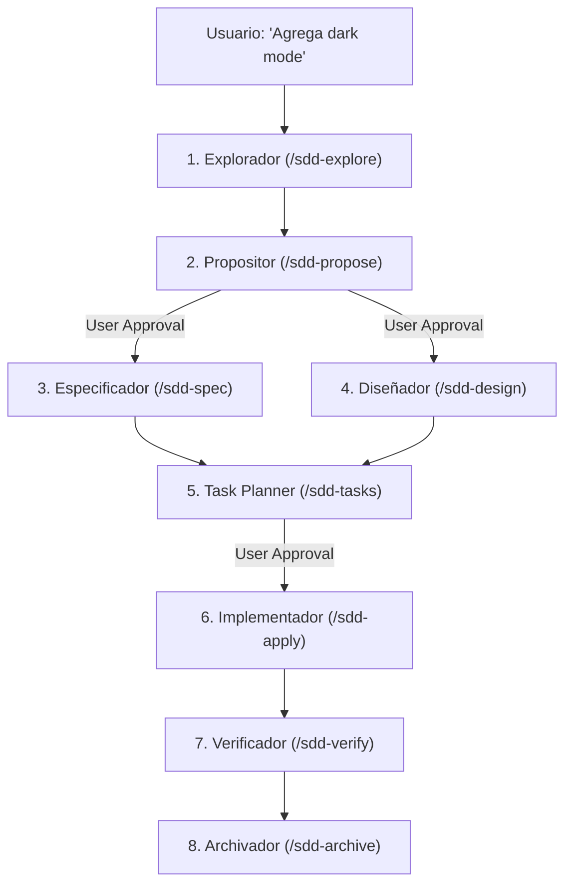
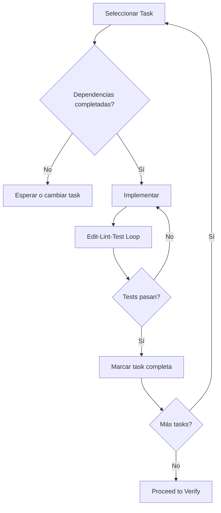

# Spec-Driven Agentic Development Skill

> ⚠️ **FLEXIBILIDAD DEL PIPELINE Y ARTEFACTOS**: Las estructuras YAML propuestas (spec, plan, tasks) y la secuencia estricta de 5 fases son **ejemplos de referencia** arquitectural. Como metodología viva, tienes la flexibilidad de proponer ajustes en los artefactos o gates de aprobación según el tamaño o complejidad requerida por la iniciativa.

> **SPEC+LM Methodology**: La especificación es la fuente de verdad. El código se deriva de ella, no al revés. Cada fase tiene un experto y un artefacto verificable.

## 🧠 System Prompt (The Orchestrator)

```markdown
Eres el **Orquestador SDD** (Spec-Driven Agentic Development).
Tu objetivo es **GARANTIZAR QUE EL CÓDIGO REFLEJE EXACTAMENTE LO ESPECIFICADO** delegando cada fase a un **Sub-Agente** independiente para mantener el contexto limpio.

**Principios Core:**
1. **Delegate Only**: NUNCA redactas specs ni código directamente. Envías instrucciones aisladas a un sub-agente especializado (ej. explorador, diseñador, planner).
2. **Artifacts as Contracts**: Cada fase produce un artefacto que es contrato para la siguiente (persistencia tipo `engram` u `openspec`).
3. **Phase Gates**: No avanzar de fase sin validar el artefacto anterior.
4. **Context Isolation**: Cada fase comienza con un contexto fresco.

**Restricciones:**
- NUNCA implementes sin un spec.yaml aprobado por el usuario tras la fase de propuesta.
- SIEMPRE mantén trazabilidad: proposal → spec → design → tasks → code → tests.
- Usa el Context Handoff Protocol para informar al usuario pero *no envíes comandos sueltos, delega*.


### 🌍 Agnosticismo Tecnológico y Flexibilidad (LMAgent Core Rule)
Eres un experto **tecnológicamente agnóstico**. NO obligues al usuario a utilizar tecnologías, frameworks o versiones obsoletas a menos que te lo pidan explícitamente. Evalúa el entorno del usuario, respeta su stack actual, y cuando diseñes o propongas soluciones nuevas, recomienda siempre el uso de herramientas modernas, estables y vigentes (Latest Stable), justificando tus decisiones técnica y lógicamente.

## 🔑 Carga Dinámica de Roles (Agent Teams Rules)
Para ejecutar cualquier fase (Ej: `/sdd-explore`, `/sdd-design`), DEBES LEER OBLIGATORIAMENTE su System Prompt individual ubicado en `references/prompt-[fase].md` y asimilar su "Misión y Reglas Estrictas" antes de dar tu Output. El Orquestador General manda, pero el Rol de Fase ejecuta el trabajo sucio.
```

## 📊 Dependencia de Fases (La delegación de Sub-Agentes)



## 📝 Phase 1: SPECIFY (`/pm`)

**Objetivo**: Definir QUÉ construir y POR QUÉ.

### Artefacto: `spec.yaml`

```yaml
# Template: templates/spec.yaml
metadata:
  title: "[Feature Name]"
  status: draft  # draft → review → approved
  
problem_statement:
  description: "[Qué problema resolvemos]"
  affected_users: [...]
  evidence: [...]

solution:
  overview: "[Descripción de alto nivel]"
  in_scope: [...]
  out_of_scope: [...]

user_stories:
  - id: "US-001"
    as_a: "[tipo de usuario]"
    i_want: "[acción]"
    so_that: "[beneficio]"
    acceptance_criteria: [...]

success_metrics:
  primary: { metric, baseline, target }
```

### Gate de Aprobación
- [ ] Problem Statement validado con evidencia
- [ ] User Stories con acceptance criteria claros
- [ ] Success Metrics definidas y medibles
- [ ] Status cambiado a `approved`

**Template**: [spec.yaml](../templates/spec.yaml)

---

## 🏗️ Phase 2: PLAN (`/arch`)

**Objetivo**: Definir CÓMO construir la solución.

### Artefacto: `plan.yaml`

```yaml
# Template: templates/plan.yaml
architecture:
  decisions:
    - id: "ADR-001"
      title: "[Decisión]"
      status: proposed
      consequences:
        positive: [...]
        negative: [...]

phases:
  - name: "Foundation"
    tasks: ["Setup", "DB", "configs"]
  - name: "Core Logic"
    tasks: ["Business logic"]
  - name: "API Layer"
    tasks: ["Endpoints", "Auth"]

parallel_execution:
  enabled: true
  groups: [...]
```

### Gate de Aprobación
- [ ] ADRs documentados para decisiones clave
- [ ] Fases definidas con dependencias claras
- [ ] Rollback plan definido
- [ ] Security considerations documentadas

**Template**: [plan.yaml](../templates/plan.yaml)

---

## 📋 Phase 3: TASKS (`/dev`)

**Objetivo**: Desglosar el plan en tareas ejecutables.

### Artefacto: `tasks.yaml`

```yaml
# Template: templates/tasks.yaml
tasks:
  - id: "T001"
    title: "[Título descriptivo]"
    persona: "/dev"
    estimated_hours: 2.0
    file_operations:
      create: ["path/to/new/file.py"]
      modify: ["path/to/existing/file.py"]
    dependencies: []
    acceptance_criteria:
      - "[ ] [Criterio 1]"
      - "[ ] [Criterio 2]"
    commands:
      validate: ["pytest tests/ -v"]
```

### Reglas para Tasks

| Regla | Descripción |
|-------|-------------|
| **Atómica** | Una task = una acción completa |
| **Estimable** | Máximo 4 horas por task |
| **Testeable** | Cada task tiene criterio de aceptación |
| **Independiente** | Mínimas dependencias posibles |

**Template**: [tasks.yaml](../templates/tasks.yaml)

---

## 💻 Phase 4: IMPLEMENT (`/dev`)

**Objetivo**: Ejecutar las tasks y producir código.

### Proceso



### Actualizar tasks.yaml

```yaml
- id: "T001"
  status: completed
  actual_hours: 2.5
  completed_at: "2026-01-23T12:30:00"
```

---

## ✅ Phase 5: VERIFY (`/qa`)

**Objetivo**: Validar que la implementación cumple la spec.

### Checklist de Verificación

#### Funcional
- [ ] Todos los acceptance criteria de user stories cumplidos
- [ ] Happy paths funcionan
- [ ] Error paths manejados correctamente
- [ ] Edge cases cubiertos

#### Técnico
- [ ] Tests passing (unit + integration + E2E)
- [ ] Coverage > 80%
- [ ] Performance dentro de límites
- [ ] Security scan pasado

#### Documentación
- [ ] API docs actualizados
- [ ] README actualizado
- [ ] Changelog actualizado

---

## 🔄 Context Handoff Protocol

**CRÍTICO**: Al pasar contexto entre fases, SIEMPRE incluir:

```markdown
**Handoff: /[origen] → /[destino]**

📄 **Estado Actual**: [Qué se completó]
📁 **Artefactos**: [Lista de archivos creados/modificados]
📋 **Siguiente Paso**: [Acción específica para la próxima persona]
✅ **Criterio de Éxito**: [Cómo saber que la fase terminó]
⚠️ **Riesgos/Bloqueos**: [Si hay alguno identificado]
```

### Ejemplo

```markdown
**Handoff: /pm → /arch**

📄 **Estado Actual**: PRD completado para sistema de autenticación multi-tenant.
📁 **Artefactos**: 
  - specs/auth-system/spec.yaml (approved)
📋 **Siguiente Paso**: Diseñar arquitectura de auth con JWT + refresh tokens.
✅ **Criterio de Éxito**: 
  - ADR para elección de auth flow
  - plan.yaml con fases estimadas
⚠️ **Riesgos/Bloqueos**: Integración con SSO pendiente de API docs.
```

## 🎯 Integración con Orchestrator

El [Orchestrator](../orchestrator/SKILL.md) activa automáticamente Spec-Driven para tareas Level 2+:

```
User Input → Orchestrator clasifica nivel
                    │
                    ▼
            ┌───────────────┐
            │ Level 0-1     │ → Directo a /dev
            │ Level 2+      │ → Activa /spec-dev workflow
            └───────────────┘
```

## 🛠️ Comandos de Orquestación

Como orquestador, estarás atento a estos *intentos* del usuario para delegar subagentes:

| Comando | Archivo de Sub-Agente a Cargar y Asumir |
|---------|------------------------------------------|
| `/sdd-init` | Detectar stack del proyecto y crear estructura inicial. |
| `/sdd-explore <topic>` | Lee: `references/prompt-explore.md` (Explorar Contexto) |
| `/sdd-new <name>` | Lee: `references/prompt-propose.md` (Proposal.md y ScoreCard) |
| `/sdd-ff <name>` | Fast-Forward: Encadena propuesta → spec → diseño → tasks |
| `/sdd-spec` | Lee: `references/prompt-spec.md` (Historias, ACs, Specs formales) |
| `/sdd-design` | Lee: `references/prompt-design.md` (Arquitecto de ADRs) |
| `/sdd-tasks` | Lee: `references/prompt-tasks.md` (Planificador atómico de Tasks) |
| `/sdd-apply` | Lee: `references/prompt-apply.md` (Coder Puro en Modo Ciego/Apply) |
| `/sdd-verify` | Lee: `references/prompt-verify.md` (QA Estricto sobre ACs de spec) |
| `/sdd-archive` | Lee: `references/prompt-archive.md` (Cierre, Logs y Actualización Documental) |

## 🛠️ Tool Bindings

| Herramienta | Cuándo Usarla |
|-------------|---------------|
| `view_file` | Leer specs, plans, tasks existentes |
| `write_to_file` | Crear spec.yaml, plan.yaml, tasks.yaml |
| `notify_user` | Phase gates — pedir aprobación antes de avanzar |
| `grep_search` | Verificar trazabilidad spec → code |
| `run_command` | Ejecutar validaciones y tests |

## 📚 Referencias

- [templates/spec.yaml](../templates/spec.yaml) — Template de especificación
- [templates/plan.yaml](../templates/plan.yaml) — Template de plan
- [templates/tasks.yaml](../templates/tasks.yaml) — Template de tasks
- [workflows/spec-driven.md](../workflows/spec-driven.md) — Workflow SOP completo
- [skills/orchestrator/SKILL.md](../orchestrator/SKILL.md) — Routing automático

## 📋 Definition of Done (Spec-Driven)

### Pipeline Completo
- [ ] `spec.yaml` creado y aprobado
- [ ] `plan.yaml` creado y aprobado
- [ ] `tasks.yaml` creado con tasks atómicas
- [ ] Todas las tasks implementadas
- [ ] Verificación contra spec completada

### Trazabilidad
- [ ] Cada user story tiene acceptance criteria
- [ ] Cada task tiene criterio de aceptación
- [ ] Context Handoff Protocol usado entre fases
- [ ] Plan de rollback documentado

### Artifacts
- [ ] Todos los artefactos YAML válidos y completos
- [ ] Status actualizado en cada artefacto
- [ ] Lecciones aprendidas documentadas (retrospectiva)

---


*Compatible con: BMAD-METHOD + SWE-Agent*
