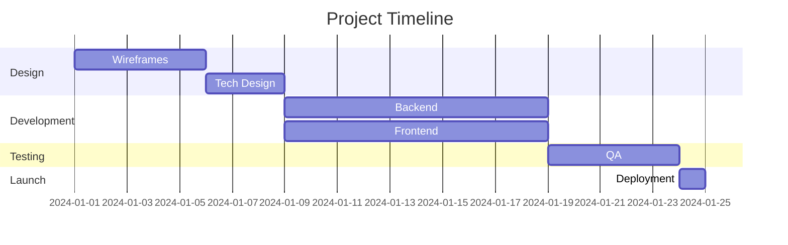

# PRD Generator Workflow (BMAD-style)

Este workflow genera un Product Requirements Document completo usando IA.

## Pre-requisitos

1. Leer [AGENTS.md](../AGENTS.md)
2. Leer [personas/product-manager.md](../personas/product-manager.md)
3. Tener una idea o concepto inicial del producto/feature

## Información Requerida

Para generar un PRD completo, necesito:

1. **Nombre del producto/feature**: ¿Cómo se llama?
2. **Problema a resolver**: ¿Qué problema resuelve? ¿Para quién?
3. **Contexto**: ¿Por qué ahora? ¿Qué existe actualmente?
4. **Usuarios objetivo**: ¿Quiénes son los usuarios?
5. **Métricas de éxito**: ¿Cómo sabremos si tuvo éxito?

---

## Proceso de Generación

```
┌─────────────────────────────────────────────────────────────────┐
│                    PRD GENERATION FLOW                          │
└─────────────────────────────────────────────────────────────────┘

    ┌──────────────────────────────────────────────────────────┐
    │  1. DISCOVERY                                            │
    │  • Entender el problema                                  │
    │  • Identificar usuarios                                  │
    │  • Analizar contexto                                     │
    └────────────────────────┬─────────────────────────────────┘
                             │
                             ▼
    ┌──────────────────────────────────────────────────────────┐
    │  2. DEFINITION                                           │
    │  • Definir scope                                         │
    │  • Priorizar features                                    │
    │  • Establecer métricas                                   │
    └────────────────────────┬─────────────────────────────────┘
                             │
                             ▼
    ┌──────────────────────────────────────────────────────────┐
    │  3. SPECIFICATION                                        │
    │  • User Stories                                          │
    │  • Acceptance Criteria                                   │
    │  • Mockups/Wireframes                                    │
    └────────────────────────┬─────────────────────────────────┘
                             │
                             ▼
    ┌──────────────────────────────────────────────────────────┐
    │  4. VALIDATION                                           │
    │  • Review con stakeholders                               │
    │  • Ajustes                                               │
    │  • Aprobación                                            │
    └──────────────────────────────────────────────────────────┘
```

---

## Template del PRD

```markdown
# PRD: {Nombre del Producto/Feature}

## 1. Información General

| Campo | Valor |
|-------|-------|
| **Nombre** | {nombre} |
| **Versión PRD** | 1.0 |
| **Autor** | {autor} |
| **Fecha** | {fecha} |
| **Estado** | Draft / In Review / Approved |

## 2. Resumen Ejecutivo

### 2.1 Problema
{Descripción clara del problema que se resuelve}

### 2.2 Solución Propuesta
{Descripción de alto nivel de la solución}

### 2.3 Objetivo
{Qué queremos lograr}

## 3. Contexto

### 3.1 Background
{Por qué es importante, historia, contexto de negocio}

### 3.2 Estado Actual
{Cómo se hace actualmente, problemas del approach actual}

### 3.3 Oportunidad
{Qué oportunidad representa este producto/feature}

## 4. Usuarios

### 4.1 Usuarios Objetivo

#### Persona 1: {Nombre}
| Campo | Descripción |
|-------|-------------|
| **Rol** | {rol} |
| **Demografía** | {edad, ubicación, etc.} |
| **Necesidades** | {qué necesita} |
| **Pain Points** | {problemas actuales} |
| **Goals** | {qué quiere lograr} |

#### Persona 2: {Nombre}
{Repetir estructura}

### 4.2 Casos de Uso Principales

| ID | Nombre | Usuario | Descripción |
|----|--------|---------|-------------|
| UC-01 | {nombre} | {persona} | {descripción} |
| UC-02 | {nombre} | {persona} | {descripción} |

## 5. Scope

### 5.1 In Scope
- {Feature 1}
- {Feature 2}
- {Feature 3}

### 5.2 Out of Scope
- {Feature X} - {Razón}
- {Feature Y} - {Razón}

### 5.3 Fases

| Fase | Features | Timeline |
|------|----------|----------|
| MVP | {features} | {time} |
| V2 | {features} | {time} |
| V3+ | {features} | {time} |

## 6. Requisitos Funcionales

### 6.1 Epic: {Nombre del Epic}

#### US-001: {Nombre de la Historia}
**Como** {tipo de usuario}
**Quiero** {acción}
**Para** {beneficio}

**Criterios de Aceptación:**
- [ ] Dado {contexto}, cuando {acción}, entonces {resultado}
- [ ] Dado {contexto}, cuando {acción}, entonces {resultado}

**Prioridad:** Must Have / Should Have / Could Have
**Story Points:** {X}

---

#### US-002: {Nombre de la Historia}
{Repetir estructura}

## 7. Requisitos No Funcionales

### 7.1 Performance
- Tiempo de carga: < {X}ms
- Throughput: {X} requests/segundo
- Latencia P99: < {X}ms

### 7.2 Seguridad
- Autenticación: {método}
- Autorización: {método}
- Encriptación: {especificación}

### 7.3 Escalabilidad
- Usuarios concurrentes: {número}
- Datos: {volumen esperado}

### 7.4 Disponibilidad
- Uptime: {%}
- RPO: {tiempo}
- RTO: {tiempo}

## 8. Métricas de Éxito

### 8.1 OKRs

**Objective**: {objetivo}

| Key Result | Target | Actual | Status |
|------------|--------|--------|--------|
| {KR1} | {valor} | - | 🔴 |
| {KR2} | {valor} | - | 🔴 |
| {KR3} | {valor} | - | 🔴 |

### 8.2 KPIs para Tracking

| KPI | Baseline | Target | Método de Medición |
|-----|----------|--------|-------------------|
| {KPI1} | {valor} | {valor} | {cómo medir} |
| {KPI2} | {valor} | {valor} | {cómo medir} |

## 9. Dependencias & Riesgos

### 9.1 Dependencias

| Dependencia | Tipo | Dueño | Status |
|-------------|------|-------|--------|
| {Dep1} | Técnica/Negocio/Externa | {nombre} | {status} |

### 9.2 Riesgos

| Riesgo | Probabilidad | Impacto | Mitigación |
|--------|--------------|---------|------------|
| {Riesgo1} | Alta/Media/Baja | Alto/Medio/Bajo | {acción} |

### 9.3 Asunciones
- {Asunción 1}
- {Asunción 2}

## 10. Timeline

### 10.1 Milestones

| Milestone | Fecha | Entregables |
|-----------|-------|-------------|
| Design Complete | {fecha} | Wireframes, Tech Design |
| Development Complete | {fecha} | Feature code, unit tests |
| QA Complete | {fecha} | Test report, bugs fixed |
| Launch | {fecha} | Production deployment |

### 10.2 Gantt (opcional)



## 11. Apéndices

### A. Mockups/Wireframes
{Incluir imágenes o links}

### B. Tech Design Reference
{Link al documento de arquitectura}

### C. Research & Data
{Links a estudios, análisis, etc.}

---

## Historial de Cambios

| Versión | Fecha | Autor | Cambios |
|---------|-------|-------|---------|
| 1.0 | {fecha} | {autor} | Initial version |
```

---

## Preguntas Guía

Al generar un PRD, hacer estas preguntas:

### Discovery
1. ¿Cuál es el problema principal que resolvemos?
2. ¿Quién tiene este problema? ¿Qué tan frecuente es?
3. ¿Cómo lo resuelven actualmente?
4. ¿Cuánto les cuesta el problema (tiempo, dinero, frustración)?

### Definition
5. ¿Cuál es nuestra solución en una oración?
6. ¿Qué hace nuestra solución que otras no hacen?
7. ¿Cuál es el alcance mínimo para resolver el problema (MVP)?
8. ¿Qué features pueden esperar a V2?

### Metrics
9. ¿Cómo sabremos si tiene éxito?
10. ¿Qué métricas moverá este producto?
11. ¿Cuánto movimiento es "suficiente" para declarar éxito?

### Risk
12. ¿Qué podría salir mal?
13. ¿Qué dependemos de otros para lograr esto?
14. ¿Qué asumimos que es verdad?

---

## Checklist de PRD Completo

- [ ] Problema claramente definido
- [ ] Usuarios identificados con personas
- [ ] Scope definido (in/out)
- [ ] User Stories con acceptance criteria
- [ ] Requisitos no funcionales
- [ ] Métricas de éxito (OKRs/KPIs)
- [ ] Dependencias listadas
- [ ] Riesgos identificados con mitigaciones
- [ ] Timeline con milestones
- [ ] Revisado por stakeholders
- [ ] Aprobado para desarrollo
