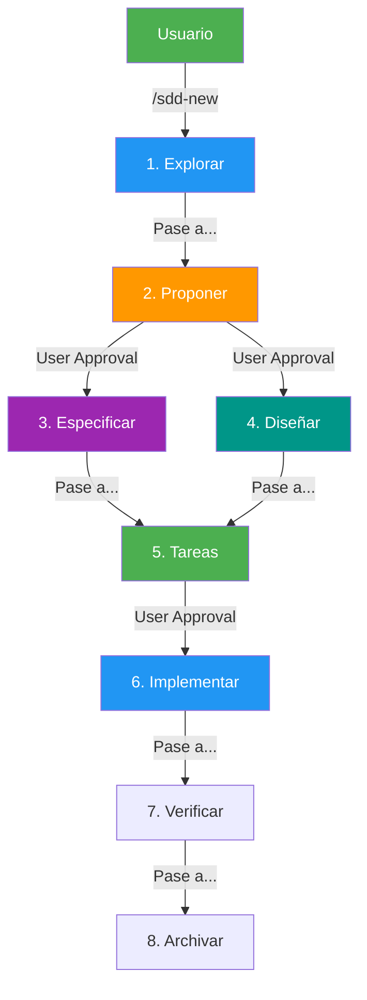
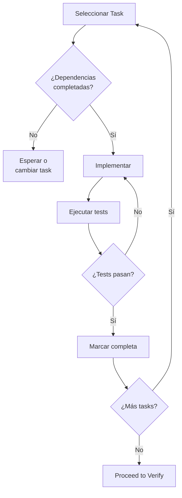

# SPEC DRIVEN Development Workflow

> **LMAgent v3.0 - SPEC+LM Methodology**
> 
> Este workflow implementa desarrollo guiado por especificaciones, donde la spec es la fuente de verdad y el código es derivado de ella.

## 🎯 Cuándo Usar Este Workflow

| Situación | Recomendación |
|-----------|---------------|
| Feature nueva compleja | ✅ Usar SPEC DRIVEN |
| Cambio de arquitectura | ✅ Usar SPEC DRIVEN |
| MVP de producto nuevo | ✅ Usar SPEC DRIVEN |
| Bug fix simple | ❌ Usar `/fix` workflow |
| Typo o config menor | ❌ Implementar directo |

---

## 📊 Overview del Flujo

```
┌─────────────────────────────────────────────────────────────────────────────┐
│                    SPEC DRIVEN DEVELOPMENT FLOW                              │
│                                                                              │
│    SPECIFY          PLAN           TASKS         IMPLEMENT      VERIFY      │
│   ─────────►    ─────────►     ─────────►     ─────────►    ─────────►     │
│                                                                              │
│  ┌──────────┐  ┌──────────┐   ┌──────────┐   ┌──────────┐  ┌──────────┐   │
│  │spec.yaml │→ │plan.yaml │→  │tasks.yaml│→  │  CODE    │→ │  TESTS   │   │
│  │          │  │          │   │          │   │          │  │          │   │
│  │  WHAT    │  │   HOW    │   │ ACTIONS  │   │ RESULT   │  │ VALIDATE │   │
│  └──────────┘  └──────────┘   └──────────┘   └──────────┘  └──────────┘   │
│                                                                              │
│    /pm            /arch          /dev          /dev+/qa       /qa          │
│   writes        designs        breaks down    implements    validates      │
│                                                                              │
└─────────────────────────────────────────────────────────────────────────────┘
```

## 📊 Overview del Flujo de Delegación



---

## 📝 Phase 1: SPECIFY (`/pm`)

**Objetivo**: Definir QUÉ construir y POR QUÉ.

### Activar Persona

```
/pm Crear especificación para [nombre del feature]
```

### Inputs Requeridos

Antes de iniciar, obtener del usuario:

1. **Problema a resolver**: ¿Qué dolor tiene el usuario?
2. **Usuario objetivo**: ¿Para quién es?
3. **Métricas de éxito**: ¿Cómo sabemos que funcionó?
4. **Restricciones**: ¿Deadline, presupuesto, tech stack?

### Crear spec.yaml

```bash
# Copiar template
cp templates/spec.yaml specs/[feature-name]/spec.yaml
```

### Secciones Críticas

| Sección | Importancia | Quién Revisa |
|---------|-------------|--------------|
| `problem_statement` | 🔴 Crítica | Product Owner |
| `solution.in_scope` | 🔴 Crítica | Tech Lead |
| `user_stories` | 🔴 Crítica | Todo el equipo |
| `success_metrics` | 🟡 Alta | Product Owner |
| `constraints` | 🟡 Alta | Architect |
| `risks` | 🟢 Media | Tech Lead |

### Definition of Done - Specify

- [ ] `spec.yaml` creado con todas las secciones completas
- [ ] Problem statement validado con datos/evidencia
- [ ] User stories con acceptance criteria claros
- [ ] Success metrics definidas y medibles
- [ ] Stakeholders notificados
- [ ] **Status cambiado a `review`**

### Checkpoint: Aprobación de Spec

```markdown
**Handoff: /pm → /arch**

📄 **Artefacto**: specs/[feature-name]/spec.yaml
📊 **Status**: review
📋 **Siguiente Paso**: Diseñar arquitectura e implementación
✅ **Criterio de Éxito**: plan.yaml aprobado
```

---

## 🏗️ Phase 2: PLAN (`/arch`)

**Objetivo**: Definir CÓMO construir la solución.

### Activar Persona

```
/arch Diseñar plan de implementación para specs/[feature-name]/spec.yaml
```

### Prerrequisitos

- [x] `spec.yaml` en status `approved`
- [x] Dependencias técnicas identificadas
- [x] Recursos disponibles confirmados

### Crear plan.yaml

```bash
# Usar spec aprobada
cp templates/plan.yaml specs/[feature-name]/plan.yaml
```

### Decisiones de Arquitectura (ADRs)

Para cada decisión significativa, documentar:

```yaml
decisions:
  - id: "ADR-001"
    title: "[Título de la decisión]"
    status: proposed
    context: "[Por qué esta decisión es necesaria]"
    decision: "[Qué se decidió]"
    consequences:
      positive: ["[Beneficios]"]
      negative: ["[Trade-offs]"]
```

### Definir Fases

| Fase | Contenido | Persona |
|------|-----------|---------|
| 1. Foundation | Setup, DB, configs | `/dev` |
| 2. Core Logic | Business logic | `/dev` |
| 3. API Layer | Endpoints, auth | `/dev` |
| 4. Integration | E2E, polish | `/dev` + `/qa` |

### Identificar Paralelismo

```yaml
parallel_execution:
  enabled: true
  groups:
    - phase: 3
      parallel_tasks:
        group_a:
          tasks: ["API endpoints"]
        group_b:
          tasks: ["Auth middleware"]
          can_run_with: ["group_a"]
```

### Definition of Done - Plan

- [ ] `plan.yaml` creado con todas las fases
- [ ] ADRs documentados para decisiones clave
- [ ] Dependencias mapeadas
- [ ] Rollback plan definido
- [ ] Security considerations documentadas
- [ ] Resource estimates completados
- [ ] **Status cambiado a `review`**

### Checkpoint: Aprobación de Plan

```markdown
**Handoff: /arch → /dev**

📄 **Artefactos**: 
  - specs/[feature-name]/spec.yaml (approved)
  - specs/[feature-name]/plan.yaml (approved)
📋 **Siguiente Paso**: Desglosar en tasks ejecutables
✅ **Criterio de Éxito**: Todas las tasks completadas
```

---

## 📋 Phase 3: TASKS (`/dev`)

**Objetivo**: Desglosar el plan en tareas ejecutables.

### Activar Persona

```
/dev Crear tasks para specs/[feature-name]/plan.yaml
```

### Crear tasks.yaml

```bash
cp templates/tasks.yaml specs/[feature-name]/tasks.yaml
```

### Reglas para Tasks

| Regla | Descripción |
|-------|-------------|
| **Atómica** | Una task = una acción completa |
| **Estimable** | Máximo 4 horas por task |
| **Testeable** | Cada task tiene criterio de aceptación |
| **Independiente** | Mínimas dependencias posibles |

### Estructura de Task

```yaml
- id: "T001"
  title: "[Título descriptivo]"
  description: "[Detalles de implementación]"
  persona: "/dev"
  estimated_hours: 2.0
  file_operations:
    create: ["path/to/new/file.py"]
    modify: ["path/to/existing/file.py"]
  dependencies: []
  blocks: ["T002"]
  acceptance_criteria:
    - "[ ] [Criterio 1]"
    - "[ ] [Criterio 2]"
  commands:
    validate: ["pytest tests/ -v"]
```

### Definition of Done - Tasks

- [ ] Todas las tasks definidas
- [ ] Dependencias mapeadas correctamente
- [ ] Estimaciones razonables (<4h por task)
- [ ] Acceptance criteria claros
- [ ] Parallel groups identificados

---

## 💻 Phase 4: IMPLEMENT (`/dev`)

**Objetivo**: Ejecutar las tasks y producir código.

### Activar Persona

```
/dev Implementar task T001 de specs/[feature-name]/tasks.yaml
```

### Proceso de Implementación



### TDD Approach (Recomendado)

```python
# 1. Escribir test primero
def test_create_entity():
    # Given
    data = {"name": "test"}
    
    # When
    result = service.create(data)
    
    # Then
    assert result.id is not None
    assert result.name == "test"

# 2. Implementar hasta que pase
# 3. Refactorizar
```

### Actualizar tasks.yaml

```yaml
- id: "T001"
  status: completed
  started_at: "2026-01-23T10:00:00"
  completed_at: "2026-01-23T12:30:00"
  completed_by: "/dev agent"
  actual_hours: 2.5
```

### Parallel Execution

Si hay tasks paralelas:

```
┌─────────────────────────────────────────┐
│  Parallel Group: Phase 3                │
│                                         │
│  Agent 1: T004 (API endpoints)         │
│  Agent 2: T005 (Auth middleware)       │
│  Agent 3: T006 (Documentation)         │
│                                         │
│  ─────────── SINCRONIZAR ────────────  │
│                                         │
│  Continuar con Phase 4                  │
└─────────────────────────────────────────┘
```

### Definition of Done - Implement

- [ ] Todas las tasks completadas
- [ ] Tests unitarios passing (>80% coverage)
- [ ] Tests de integración passing
- [ ] Linting sin errores
- [ ] Documentación actualizada
- [ ] Code review completado

---

## ✅ Phase 5: VERIFY (`/qa`)

**Objetivo**: Validar que la implementación cumple la spec.

### Activar Persona

```
/qa Verificar implementación contra specs/[feature-name]/spec.yaml
```

### Checklist de Verificación

#### Funcional

- [ ] Todos los acceptance criteria de user stories cumplidos
- [ ] Happy paths funcionan
- [ ] Error paths manejados correctamente
- [ ] Edge cases cubiertos

#### Técnico

- [ ] Tests passing (unit + integration + E2E)
- [ ] Coverage > 80%
- [ ] Performance dentro de límites
- [ ] Security scan pasado

#### Documentación

- [ ] API docs actualizados
- [ ] README actualizado
- [ ] Changelog actualizado

### Validación contra Spec

```python
# Script de validación automática
def validate_against_spec(spec_path, implementation):
    spec = load_yaml(spec_path)
    
    results = {
        "passed": [],
        "failed": []
    }
    
    for story in spec["user_stories"]:
        for criterion in story["acceptance_criteria"]:
            if test_criterion(criterion, implementation):
                results["passed"].append(criterion)
            else:
                results["failed"].append(criterion)
    
    return results
```

### Definition of Done - Verify

- [ ] 100% acceptance criteria verificados
- [ ] Tests passing
- [ ] Performance verificado
- [ ] Security verificado
- [ ] Stakeholder sign-off obtenido

---

## 🚀 Completion

### Marcar Spec como Completada

```yaml
# En spec.yaml
metadata:
  status: completed
  completed_at: "[YYYY-MM-DD]"
```

### Documentar Lecciones Aprendidas

```markdown
## Retrospectiva: [Feature Name]

### ¿Qué funcionó bien?
- [...]

### ¿Qué podría mejorar?
- [...]

### Métricas finales
- Tiempo estimado: X horas
- Tiempo real: Y horas
- Variación: Z%
```

---

## 🔧 Comandos Rápidos SDD

| Comando | Meta / Sub-Agente a invocar |
|---------|----------------------------|
| `/sdd-init` | Detectar stack del proyecto y crear estructura inicial. |
| `/sdd-explore <topic>` | Iniciar **Explorador**: Lee código, compara enfoques. No escribe código. |
| `/sdd-new <name>` | Iniciar **Propositor**: Escribe `proposal.md` con la intención. |
| `/sdd-ff <name>` | Fast-Forward: Encadena propuesta → spec → diseño → tasks |
| `/sdd-spec` | Iniciar **Especificador**: Escribe historias de usuario y criterios de aceptación. |
| `/sdd-design` | Iniciar **Diseñador**: Define la arquitectura (ADRs) requerida. |
| `/sdd-tasks` | Iniciar **Planner**: Rompe la especificación en tareas atómicas (`tasks.yaml`). |
| `/sdd-apply` | Iniciar **Implementador**: Toma las tasks y escribe el código fuente en lotes. |
| `/sdd-verify` | Iniciar **Verificador**: Revisa el código contra los criterios de aceptación. |
| `/sdd-archive` | Iniciar **Archivador**: Cierra el pipeline (commit final, documentación). |

---

## 📚 Referencias

- [spec.yaml template](../templates/spec.yaml)
- [plan.yaml template](../templates/plan.yaml)
- [tasks.yaml template](../templates/tasks.yaml)
- [Product Manager persona](../personas/product-manager.md)
- [Architect persona](../personas/architect.md)
- [Backend Engineer persona](../personas/backend-engineer.md)
- [QA Engineer persona](../personas/qa-engineer.md)

---

*Workflow version: "3.5.0" (SPEC+LM)*
*Compatible con: BMAD-METHOD + SWE-agent*
