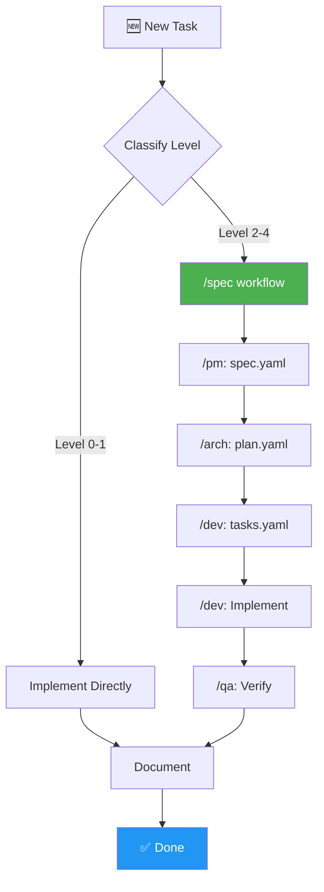

# AGENTS.md

> **🤖 AI AGENT: READ THIS FIRST!**
> This project uses the **LMAgent Framework v3.0 (SPEC+LM)**. Before making ANY changes:
> 1. Read this entire file to understand the workflow
> 2. Follow the level system (0-4) for task classification
> 3. Use the appropriate persona for each task type
> 4. For Level 2+: Use SPEC DRIVEN workflow (`/spec`)
> 5. NEVER skip documentation updates

---

## 🚀 AUTO-DETECTION (New Project)

> **¿Detectaste un archivo `PROJECT_KICKOFF.md` en la raíz?**
>
> Si existe `PROJECT_KICKOFF.md`, esto es un **NUEVO PROYECTO**. Ejecuta automáticamente:
>
> 1. `lmagent init` - Inicializar framework
> 2. Leer `PROJECT_KICKOFF.md` completo
> 3. Ejecutar workflow `/spec` con la información del kickoff
> 4. Crear `specs/[project-name]/spec.yaml`
> 5. Mostrar al usuario y pedir aprobación
> 6. Continuar con `plan.yaml` → `tasks.yaml` → Implementación
>
> **Ver**: [docs/how-to-start.md](docs/how-to-start.md) para flujo completo.

---

## 🔄 SESSION RECOVERY (Proyectos en Progreso)

> **⚠️ CRÍTICO PARA PROYECTOS GRANDES**
>
> **AL INICIO DE CADA SESIÓN**, ejecuta este protocolo:

### Paso 1: Verificar Estado del Proyecto
```
1. Leer .lmagent/session.yaml (si existe)
2. Identificar: current_phase, current_task_id, last_action
3. Si awaiting_user_input = true → Preguntar al usuario primero
```

### Paso 2: Resumir Contexto
```
Antes de hacer CUALQUIER cambio, informa al usuario:

"📍 **Estado del Proyecto**: [project_name]
   - Fase actual: [current_phase]
   - Última acción: [last_action]
   - Task actual: [current_task_id]
   
   ¿Continuamos desde aquí o hay algo más urgente?"
```

### Paso 3: Al Finalizar Trabajo
```
SIEMPRE actualiza .lmagent/session.yaml con:
- last_action: Qué hiciste
- current_task_id: En qué task estás
- completed_tasks: Agregar tasks completadas
- Incrementar session en sessions[]
```

### Archivos de Estado a Consultar

| Archivo | Propósito | Leer Cuando |
|---------|-----------|-------------|
| `.lmagent/session.yaml` | Estado de sesión | Inicio de CADA sesión |
| `specs/[name]/spec.yaml` | Qué construir | Dudas sobre scope |
| `specs/[name]/plan.yaml` | Cómo construir | Dudas sobre arquitectura |
| `specs/[name]/tasks.yaml` | Qué hacer ahora | Ver próxima task |

### Recuperación de Emergencia

Si perdiste contexto o el usuario pregunta "¿dónde estábamos?":

```bash
# 1. Leer estado
cat .lmagent/session.yaml

# 2. Ver tasks pendientes
grep "status: pending" specs/*/tasks.yaml

# 3. Ver último archivo modificado
ls -lt src/ | head -5

# 4. Ver últimos checkpoints
ls -lt .lmagent/checkpoints/ | head -5
```

---

## 💾 CHECKPOINT SYSTEM (Auto-Backup)

> **⚠️ CRÍTICO**: Crea checkpoints automáticamente para NUNCA perder progreso.

### Cuándo Crear Checkpoints

| Evento | Trigger | Nombre del Checkpoint |
|--------|---------|----------------------|
| Fase completada | Usuario aprueba spec/plan | `phase_specify_complete` |
| Task completada | Marcas task como done | `task_T00X_complete` |
| Decisión importante | ADR creado | `decision_D00X` |
| Fin de sesión | Usuario cierra | `session_X_end` |
| Manual | Usuario pide backup | `manual_YYYYMMDD` |

### Crear Checkpoint

Después de cada milestone, crea archivo en `.lmagent/checkpoints/`:

```yaml
# .lmagent/checkpoints/chk_20260123_143052.yaml
checkpoint:
  id: "chk_20260123_143052"
  trigger: "task_complete"
  trigger_details:
    type: "task"
    id: "T002"
  state_snapshot:
    current_phase: "implement"
    tasks_completed: 2
    tasks_pending: 12
    current_task_id: "T003"
  summary: "Completé T002. Próximo: T003."
```

### Restaurar de Checkpoint

Si el usuario dice "volver atrás" o "algo salió mal":

```bash
# 1. Listar checkpoints disponibles
ls -lt .lmagent/checkpoints/ | head -10

# 2. Mostrar al usuario y que elija
# 3. Leer el checkpoint elegido
# 4. Restaurar session.yaml al estado del checkpoint
```

### Política de Retención

- ✅ Mantener: Todos los checkpoints de **fase** (nunca borrar)
- ✅ Mantener: Últimos 20 checkpoints de **task**
- ✅ Mantener: Últimos 10 checkpoints de **sesión**
- 🗑️ Auto-limpiar cuando hay más de 50 checkpoints

---

## 🗺️ Visual Navigation Guide

```
┌─────────────────────────────────────────────────────────────────────────────┐
│                         LMAGENT DECISION FLOW                                │
│                                                                              │
│  ┌──────────────┐                                                            │
│  │ NEW TASK     │                                                            │
│  └──────┬───────┘                                                            │
│         │                                                                    │
│         ▼                                                                    │
│  ┌──────────────┐     ┌─────────────────────────────────────────────────┐   │
│  │ CLASSIFY     │────▶│ Level 0-1: Implement directly                   │   │
│  │ (Level 0-4)  │     │ Level 2-4: Create plan, get approval            │   │
│  └──────┬───────┘     └─────────────────────────────────────────────────┘   │
│         │                                                                    │
│         ▼                                                                    │
│  ┌──────────────┐     ┌─────────────────────────────────────────────────┐   │
│  │ SELECT       │────▶│ /pm (Product) → /arch (Design) → /dev (Code)   │   │
│  │ PERSONA(S)   │     │ /qa (Test) → /sec (Security) → /devops (Deploy)│   │
│  └──────┬───────┘     └─────────────────────────────────────────────────┘   │
│         │                                                                    │
│         ▼                                                                    │
│  ┌──────────────┐     ┌─────────────────────────────────────────────────┐   │
│  │ IMPLEMENT    │────▶│ Follow checklist for level                      │   │
│  │ + VALIDATE   │     │ Run tests, lint, document                       │   │
│  └──────┬───────┘     └─────────────────────────────────────────────────┘   │
│         │                                                                    │
│         ▼                                                                    │
│  ┌──────────────┐                                                            │
│  │ ✅ DOCUMENT  │ ← CRITICAL: Update docs, rules, changelog                 │
│  └──────────────┘                                                            │
└─────────────────────────────────────────────────────────────────────────────┘
```



---

## Setup Commands

```bash
# Install framework (if not installed)
pip install -e .

# Initialize in a new project
lmagent init

# Verify installation
lmagent doctor

# Show version
lmagent --version
```

## Code Style

- **Python**: FastAPI, SQLModel, Pydantic v2, async/await
- **TypeScript**: NestJS, Prisma, strict mode
- **Testing**: pytest-asyncio, Jest (>80% coverage)
- **Linting**: ruff (Python), ESLint (TS)
- **Commits**: `type(scope): description` (feat, fix, refactor, docs, test)

## Project Structure

```
personas/       # 18 specialized AI personas (V3.0 format)
workflows/      # 13 reusable workflow templates (includes /spec)
rules/          # 9 rule files (stack, code-style, security, etc.)
config/         # YAML configs (tools, commands, models, levels)
templates/      # SPEC DRIVEN templates (spec.yaml, plan.yaml, tasks.yaml)
agents/         # Python runtime with CLI and tools
```

---

## 🎯 Propósito

LMAgent es un marco de trabajo diseñado para equipos de automatización y desarrollo de agentes de IA. Proporciona estructura, reglas y workflows para que los agentes de IA (y humanos) trabajen de manera consistente y eficiente.

**Metodología**: SPEC+LM = BMAD-METHOD + SWE-agent + SPEC DRIVEN Development

## 🚀 Quick Reference (Tabla de Comandos)

| Intención | Comando | Persona / Acción |
|-----------|---------|------------------|
| **SPEC DRIVEN** | `/spec` | **Workflow completo**: spec→plan→tasks→implement |
| **Planificar** | `/pm` | **Product Manager**: Requisitos, PRDs, spec.yaml |
| **Diseñar** | `/arch` | **Architect**: Sistema, DB, APIs, plan.yaml |
| **Programar** | `/dev` | **Backend**: Código, Tests, tasks.yaml |
| **Automatizar** | `/auto` | **Automation**: n8n, Webhooks |
| **Testear** | `/qa` | **QA Engineer**: E2E, Unit Tests |
| **Prompting** | `/prompt` | **Prompt Engineer**: Optimización Cognitiva |
| **Organizar** | `/sm` | **Scrum Master**: Proceso, Bloqueos |
| **Workflow** | `/fix` | Workflow de Bugfix sistemático |
| **Workflow** | `/new-feature` | Workflow de nueva funcionalidad |
| **Modo** | `/yolo` | Modo rápido (sin confirmaciones L0-L1) |

---

## 📋 Antes de Empezar


1. **Lee este archivo completo**
2. **Revisa las reglas** en `rules/` (especialmente `documentation.md`)
3. **Identifica el nivel** de complejidad de tu tarea (0-4)
4. **Selecciona la persona** apropiada si aplica
5. **Sigue el workflow** correspondiente

---

## 🎚️ Sistema de Niveles Adaptativos

Cada tarea debe clasificarse en un nivel que determina la profundidad de planificación requerida:

### Level 0: Trivial
- **Ejemplos**: Typos, fix de formato, cambios de configuración menores
- **Tiempo**: < 5 minutos
- **Planning**: No requerido
- **Acción**: Implementar directamente

### Level 1: Small
- **Ejemplos**: Bug fixes simples, refactors localizados, agregar logs
- **Tiempo**: 5-30 minutos
- **Planning**: Minimal (descripción breve del cambio)
- **Checklist**: `checklists/level-1-small.md`

### Level 2: Medium
- **Ejemplos**: Features nuevos, integraciones simples, endpoints nuevos
- **Tiempo**: 30 min - 2 horas
- **Planning**: Standard (implementation_plan.md)
- **Checklist**: `checklists/level-2-medium.md`
- **Artefactos**: Plan de implementación

### Level 3: Complex
- **Ejemplos**: Sistemas nuevos, arquitectura nueva, múltiples servicios
- **Tiempo**: 2-8 horas
- **Planning**: Extensivo (múltiples artefactos)
- **Checklist**: `checklists/level-3-complex.md`
- **Artefactos**: Plan, arquitectura, plan de tests

### Level 4: Enterprise
- **Ejemplos**: Migraciones, cambios críticos, compliance
- **Tiempo**: 8+ horas
- **Planning**: Audit (revisión humana obligatoria)
- **Checklist**: `checklists/level-4-enterprise.md`
- **Artefactos**: Plan, arquitectura, tests, seguridad, rollback

---

## 👥 Personas / Roles

Los agentes pueden asumir diferentes "personas" según la tarea:

### Product Manager
> Análisis de procesos, requisitos de negocio, historias de usuario
- Lee: `personas/product-manager.md`
- Activa cuando: Se definen nuevas features o se analizan procesos

### Architect
> Diseño de sistemas, APIs, bases de datos, integraciones
- Lee: `personas/architect.md`
- Activa cuando: Se diseña arquitectura o se toman decisiones técnicas (Level 2+)

### Backend Engineer
> Implementación en Python/FastAPI o NodeJS/TypeScript
- Lee: `personas/backend-engineer.md`
- Activa cuando: Se implementa código de backend

### Automation Engineer
> n8n, webhooks, colas, eventos, integraciones
- Lee: `personas/automation-engineer.md`
- Activa cuando: Se crean automatizaciones o integraciones

### AI Agent Engineer
> Diseño de agentes, prompts, tools, pipelines de IA
- Lee: `personas/ai-agent-engineer.md`
- Activa cuando: Se trabaja con código de agentes o RAG

### Prompt Engineer
> Arquitectura cognitiva, System Prompts, CoT, DSPy (Mente del LLM)
- Lee: `personas/prompt-engineer.md`
- Activa cuando: Se optimiza razonamiento o calidad de respuestas

### QA Engineer
> Testing, validación, aseguramiento de calidad
- Lee: `personas/qa-engineer.md`
- Activa cuando: Se escriben o revisan tests

### Security Analyst
> Revisiones de seguridad, vulnerabilidades, compliance
- Lee: `personas/security-analyst.md`
- Activa cuando: Cambios sensibles, auth, datos personales (Level 3+)

### Scrum Master
> Facilitación, proceso, mejora continua
- Lee: `personas/scrum-master.md`
- Activa cuando: Se organizan sprints o se mejoran procesos

---

## 🔄 Flujo de Trabajo Estándar

```
┌─────────────────────────────────────────────────────────────────┐
│                    FLUJO DE TRABAJO LMAGENT                      │
└─────────────────────────────────────────────────────────────────┘
                              │
                              ▼
                    ┌─────────────────┐
                    │  1. ENTENDER    │
                    │   Leer AGENTS.md│
                    │   Leer reglas   │
                    └────────┬────────┘
                              │
                              ▼
                    ┌─────────────────┐
                    │  2. CLASIFICAR  │
                    │   Nivel (0-4)   │
                    │   Persona(s)    │
                    └────────┬────────┘
                              │
              ┌───────────────┴───────────────┐
              │                               │
              ▼                               ▼
     ┌────────────────┐              ┌────────────────┐
     │  Level 0-1     │              │  Level 2-4     │
     │  Implementar   │              │  Crear Plan    │
     │  directamente  │              │  Pedir review  │
     └───────┬────────┘              └───────┬────────┘
              │                               │
              │                               ▼
              │                      ┌────────────────┐
              │                      │  3. PLANEAR    │
              │                      │  Artefactos    │
              │                      │  según nivel   │
              │                      └───────┬────────┘
              │                               │
              └───────────────┬───────────────┘
                              │
                              ▼
                    ┌─────────────────┐
                    │  4. IMPLEMENTAR │
                    │  Código limpio  │
                    │  Commits claros │
                    └────────┬────────┘
                              │
                              ▼
                    ┌─────────────────┐
                    │  5. VALIDAR     │
                    │  Tests          │
                    │  Linting        │
                    └────────┬────────┘
                              │
                              ▼
                    ┌─────────────────┐
                    │  6. DOCUMENTAR  │
                    │  README         │
                    │  Comentarios    │
                    └─────────────────┘
```

---

## 📁 Reglas del Proyecto

Las reglas definen estándares que SIEMPRE deben seguirse:

| Archivo | Descripción |
|---------|-------------|
| `rules/documentation.md` | ⚠️ **Documentación continua (CRÍTICO)** |
| `rules/stack.md` | Stack tecnológico y buenas prácticas |
| `rules/workflow.md` | Flujo de trabajo detallado |
| `rules/code-style.md` | Guías de estilo Python y TypeScript |
| `rules/agents-ia.md` | Reglas para código de agentes IA |
| `rules/automations-n8n.md` | Reglas para integraciones con n8n |
| `rules/issue-resolution.md` | Resolución autónoma de issues |

---

## 📝 Workflows Disponibles

Los workflows son guías paso a paso para tareas comunes:

| Workflow | Uso |
|----------|-----|
| `workflows/spec-driven.md` | ⭐ **SPEC DRIVEN**: spec→plan→tasks→implement (Level 2+) |
| `workflows/new-automation.md` | Crear nueva automatización backend + n8n |
| `workflows/new-agent-ia.md` | Crear o mejorar un agente de IA |
| `workflows/bugfix-backend.md` | Analizar y arreglar bugs en backends |
| `workflows/optimize-performance.md` | Identificar y resolver cuellos de botella |
| `workflows/resolve-github-issue.md` | Resolver issues de GitHub automáticamente |
| `workflows/security-review.md` | Realizar revisión de seguridad |

---

## 🔄 Context Handoff Protocol

Cuando cambias de persona durante una tarea compleja, SIEMPRE incluye:

```markdown
**Handoff: /[persona_origen] → /[persona_destino]**

📄 **Estado Actual**: [Qué se ha completado]
📁 **Artefactos**: [Archivos creados/modificados]
📋 **Siguiente Paso**: [Qué debe hacer la próxima persona]
✅ **Criterio de Éxito**: [Cómo saber que terminó]
```

| Elemento | Descripción | Ejemplo |
|----------|-------------|---------|
| **Estado Actual** | Progreso hasta ahora | "PRD completado y aprobado" |
| **Artefactos** | Archivos relevantes | "specs/login/spec.yaml" |
| **Siguiente Paso** | Acción clara | "Diseñar arquitectura de auth" |
| **Criterio de Éxito** | Definition of Done | "ADR escrito, diagrama C4 creado" |

---

## 🛠️ Tool Registry

Las herramientas disponibles para los agentes están definidas en `config/tools.yaml`:

- **http_request**: Requests HTTP a APIs externas
- **database_query**: Queries a PostgreSQL
- **redis_cache**: Operaciones de cache/estado en Redis
- **github_issue**: Interacción con GitHub Issues y PRs
- **sandbox_execute**: Ejecución de código en sandbox Docker

---

## ⚡ Comandos Rápidos

```bash
# Iniciar workflow SPEC DRIVEN (recomendado para Level 2+)
/spec [nombre-feature]

# Cambiar de persona
/pm, /arch, /dev, /qa, /sec, /devops

# Ver checklist de nivel
/checklist [0-4]

# Modo sin confirmaciones (Level 0-1 solamente)
/yolo
```

---

## 🚨 Reglas de Oro

1. **Siempre lee AGENTS.md y reglas antes de cambios grandes**
2. **Clasifica el nivel ANTES de empezar**
3. **Para Level 2+, usa workflow `/spec`** ← ⭐ Nuevo
4. **Commits pequeños y descriptivos**
5. **Tests para todo código nuevo**
6. **📚 DOCUMENTA CAMBIOS SIGNIFICATIVOS** ← ⚠️ Crítico
7. **Usa Context Handoff Protocol al cambiar de persona**
8. **Si hay duda, pregunta**

> 💡 **Recuerda**: Si pensaste más de 5 minutos en algo, probablemente vale la pena documentarlo.

---

## 🆘 Troubleshooting

| Problema | Solución |
|----------|----------|
| No sé qué nivel asignar | Pregunta: "¿Cuánto tiempo tomará?" y consulta la tabla de niveles |
| No sé qué persona usar | Usa `/orch` (Orchestrator) para que decida |
| Workflow se siente lento | Para Level 0-1, usa `/yolo` para saltar confirmaciones |
| Spec muy grande | Divide en múltiples specs más pequeñas |
| Persona "trabada" | Cambia a otra persona o escala con `/lead` |
| No encuentro archivo | Usa `lmagent doctor` para verificar estructura |

---

## 📊 Métricas de Calidad

Los agentes deben mantener:

- ✅ Cobertura de tests > 80%
- ✅ Sin errores de linting
- ✅ Documentación actualizada
- ✅ Tiempo de respuesta de APIs < 500ms
- ✅ Logs estructurados en todos los servicios
- ✅ Specs validadas contra acceptance criteria

---

## 🔗 Referencias

- [README.md](README.md) - Documentación general
- [docs/getting-started.md](docs/getting-started.md) - Primeros pasos
- [docs/personas-guide.md](docs/personas-guide.md) - Guía de personas
- [docs/levels-guide.md](docs/levels-guide.md) - Guía de niveles
- [templates/](templates/) - Templates SPEC DRIVEN (spec.yaml, plan.yaml, tasks.yaml)
- [workflows/spec-driven.md](workflows/spec-driven.md) - Workflow completo SPEC DRIVEN

---

*LMAgent v3.0 (SPEC+LM) - Build More, Automate Dreams* 🚀
*Metodología: BMAD-METHOD + SWE-agent + SPEC DRIVEN Development*

