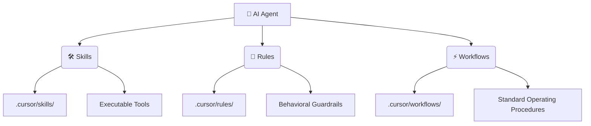

# 🧠 LMAgent: The Universal AI Agent Runtime

  

> **"Separate the reasoning from the execution."**  
> LMAgent is the foundational runtime that empowers your AI Agents with standardized **Skills**, **Rules**, and **Workflows** across any IDE.

---

## 🌟 Why LMAgent?

In the era of Agentic AI, your "System Prompt" is not enough. You need a structured **Cognitive Architecture**. LMAgent provides the **3 Pillars** of Agent Identity, instantly compatible with Cursor, Windsurf, VSCode, Zed, Qodo, and more.

### 🏛️ The 3-Pillar Architecture



---

## 🚀 Quick Start Guide

Get your agent infrastructure up and running in less than 2 minutes.

### Option A: Direct Execution (No Install)
The fastest way to enhance your current project.

```bash
npx lmagent install
```

### Option B: Local Development Setup
If you want to contribute or fork the project:

1.  **Clone the Repository**
    ```bash
    git clone https://github.com/QuBit/lmagent.git
    cd lmagent
    ```

2.  **Install Dependencies**
    ```bash
    npm install
    ```

3.  **Link Globally (Optional)**
    ```bash
    npm link
    lmagent install
    ```

---

## ✨ The Installation Experience

The interactive CLI detects your environment and sets up the optimal configuration:

```text
🔄 Sincronizando repositorio global (~/.agents)...
✔ Repositorio global sincronizado correctamente.

🔹 Configuración de Instalación
? ¿Dónde quieres instalar los artefactos?
> En mi Usuario / Global IDE Config (~/) (Recomendado) 👈 
  En este Proyecto (./)

? Método de Instalación: Symlink (Recomendado - Live Updates)
? Selecciona los Skills: [✔] ai-agent-engineer, [✔] fullstack-dev...
? Selecciona las Reglas: [✔] code-style, [✔] security...
? Selecciona los Workflows: [✔] new-feature, [✔] bugfix...

✨ Instalación Finalizada ✨
```

---

## 💎 Key Features

### 1. 🌍 Centralized "Brain" (`~/.agents`)
LMAgent creates a **Single Source of Truth** in your home directory.
*   **Update Once, Reflect Everywhere**: Modify a rule in `~/.agents/rules/code-style.md`, and *every project* using Symlinks updates instantly.
*   **Zero-Copy Efficiency**: No more valid/duplicate `.md` files cluttering every repo.

### 2. 🧩 Multi-IDE Support
We speak your IDE's language perfectly.

| IDE / Agent | Support Level | Config Path |
| :--- | :--- | :--- |
| **Cursor** | ✅ Full | `.cursor/` |
| **Windsurf** | ✅ Full | `.windsurf/` |
| **VSCode / Copilot** | ✅ Full | `.github/` |
| **Zed** | ✅ Full | `.rules/` |
| **Claude Code** | ✅ Beta | `.claude/` |
| **Qodo** | ✅ Beta | `agents/` |

### 3. 📦 Standardized Skills (`skills.sh`)
We follow the [Agent Skills Standard](https://github.com/skills-sh/spec).
Each Skill is a self-contained unit:
```text
skills/
  react-best-practices/
    SKILL.md       # Metadata & Instructions for the LLM
    scripts/       # Executable bash/python scripts
    templates/     # Code templates
```

---

## 📚 Included Capabilities

See [AGENTS.md](./lmagent/AGENTS.md) for the full catalog.

*   **🧠 Personas**: `ai-agent-engineer`, `fullstack-architect`, `devops-specialist`
*   **🛡️ Rules**: `code-style`, `security`, `testing`
*   **⚡ Workflows**: `new-feature`, `bugfix-backend`, `generate-prd`

---

## 🤝 Contributing

We welcome contributions to expand the **Universal Agent Brain**.
Check out `CONTRIBUTING.md` to add new Skills, Rules, or IDE support.

---

<p align="center">
  Built with ❤️ by <b>QuBit</b>
</p>
