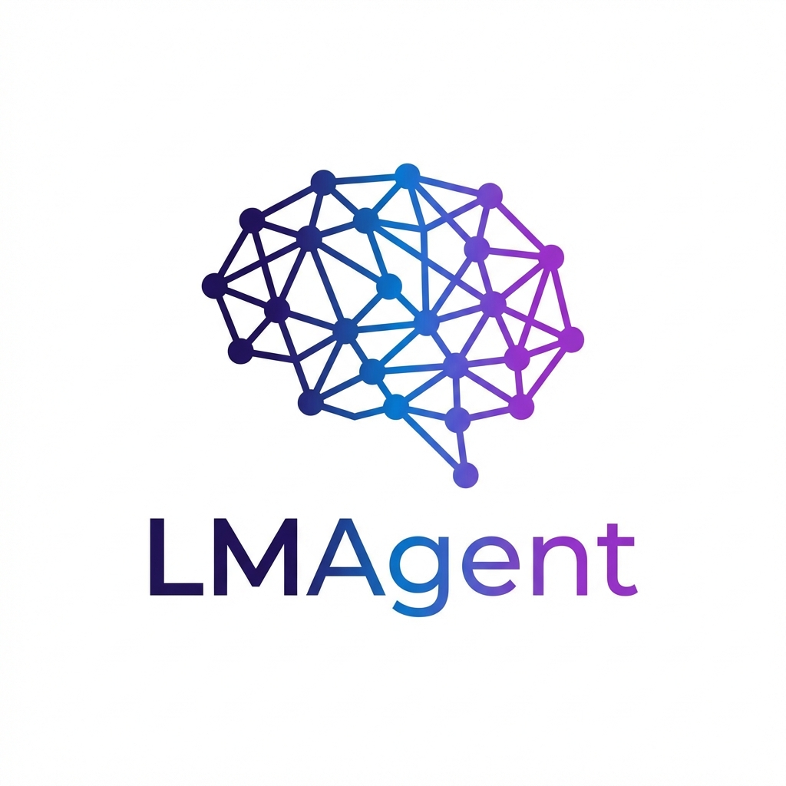

# LMAgent Framework
<div align="center">
  
  <br/>
  <h1>LMAgent</h1>
  <p><strong>Universal AI Agent Framework for 2026</strong></p>
  <p><em>Version 3.0 (SPEC+LM) - BMAD + SWE + SPEC DRIVEN Development</em></p>
</div>

[](LICENSE)
[](CONTRIBUTING.md)
[](https://python.org)
[](#-token-efficiency-strategy)

**LMAgent** es un marco de trabajo universal para equipos de automatización y desarrollo de agentes de IA. Combina lo mejor de [BMAD-METHOD](https://github.com/bmadcode/BMAD-METHOD), [SWE-agent](https://github.com/princeton-nlp/SWE-agent), y **SPEC DRIVEN Development** en un framework unificado compatible con cualquier IDE agéntico.

**Metodología SPEC+LM**: spec.yaml → plan.yaml → tasks.yaml → CODE → VERIFY

> ⚠️ **Regla crítica**: Mantén la documentación actualizada. Ver `rules/documentation.md`.

## ⚡ Token Efficiency Strategy

¿Preocupado por el consumo de tokens? **LMAgent está diseñado para ser eficiente.**

1.  **Lazy Loading**: El Orchestrator NO carga todos los roles. Solo carga el archivo necesario (ej. `/pm` carga solo `product-manager.md`).
2.  **Modular Context**: Cada persona es un archivo autocontenido. No hay "contaminación de contexto".
3.  **Senior Concise Instructions**: Al usar roles Senior, las instrucciones son densas pero directas, evitando round-trips innecesarios de corrección.

## 🚀 Quick Start

### Opción A: Instalación Global (Recomendado)
Instala LMAgent para usarlo en cualquier proyecto de tu sistema.

```bash
# 1. Clonar el repositorio
git clone https://github.com/QuBiit0/lmagent.git
cd lmagent

# 2. Instalar el CLI
pip install -e .

# 3. Verificar instalación
lmagent --version
```

### Opción B: Usar en un Proyecto Nuevo
Una vez instalado el CLI:

```bash
mkdir mi-nuevo-proyecto
cd mi-nuevo-proyecto
lmagent init
```

💡 **Tip:** ¿Empiezas un proyecto nuevo? Usa nuestra **[Plantilla de Inicio Rápido](templates/project_brief.md)**.

Esto crea una estructura limpia con todo el framework en `.agent/`.

## ✨ Features

### De BMAD-METHOD
| Feature | Implementación |
|---------|----------------|
| **Scale-Adaptive Levels (0-4)** | `config/levels.yaml` + checklists |
| **9 Personas Especializadas** | `personas/*.md` con expertise y triggers |
| **Orchestrator Agent** | Meta-agente que decide routing automático |
| **PRD Generator** | `workflows/generate-prd.md` |
| **Ideation Mode** | `workflows/ideation.md` |
| **IDE Commands** | `/pm`, `/dev`, `/yolo`, etc. |

### De SWE-agent
| Feature | Implementación |
|---------|----------------|
| **YAML Tool Registry** | `config/tools.yaml` + `config/tools-extended.yaml` |
| **Python Tool Implementations** | `agents/tools/*.py` |
| **Agent Runtime** | `agents/runtime.py` con ReAct loop |
| **Trajectory Logging** | STEP/THOUGHT/ACTION/OBSERVATION |
| **Cost Tracking** | Per-request, per-task, per-issue |
| **Docker Sandbox** | `Dockerfile.sandbox` |
| **Edit-Lint Loop** | Auto-lint después de cada edit |
| **Git Integration** | Tools para todas las operaciones git |

### Exclusivo de LMAgent
| Feature | Descripción |
|---------|-------------|
| **Multi-IDE Support** | Antigravity, Claude, Cursor, Windsurf, Roo Code, Copilot |
| **n8n Integration** | Reglas y patterns para automatizaciones |
| **Spanish-First** | Configuración de idioma preferido |
| **Extensions System** | Plugins para extender funcionalidad |
| **CLI Tool** | `lmagent run "task"` con slash commands |

## 📁 Estructura

```
lmagent/
├── AGENTS.md                   # Documento principal del framework
├── README.md                   # Este archivo
├── LICENSE                     # MIT License
├── pyproject.toml              # Configuración Python
├── .env.example                # Template de variables de entorno
│
├── .agent/                     # Antigravity
├── .cursorrules                # Cursor
├── CLAUDE.md                   # Claude Code
├── .github/copilot-instructions.md  # GitHub Copilot
│
├── config/                     # Configuración global
├── personas/                   # 18 roles especializados Senior (v2.1)
├── rules/                      # Reglas del proyecto
├── workflows/                  # Workflows reutilizables
├── checklists/                 # Checklists por nivel
├── agents/                     # Runtime Python y tools
├── templates/                  # Templates de proyectos
├── docs/                       # Documentación extendida
└── sandbox/                    # Docker sandbox
```

## 🎯 Sistema de Niveles

| Nivel | Nombre | Tiempo Est. | Confirmación | Artefactos |
|-------|--------|-------------|--------------|------------|
| 0 | Trivial | < 5 min | No | Ninguno |
| 1 | Small | 5-30 min | No | Commit |
| 2 | Medium | 30 min - 2 hrs | Sí | Plan + PR |
| 3 | Complex | 2-8 hrs | Múltiples | Arquitectura + Tests |
| 4 | Enterprise | 8+ hrs | Governance | Audit completo |

## 👥 Personas Disponibles

| Comando | Persona | Especialidad |
|---------|---------|--------------|
| `/orch` | Orchestrator | Meta-routing automático |
| `/pm` | Product Manager | Requisitos, PRDs avanzados |
| `/arch` | Architect | Diseño de sistemas resilientes |
| `/dev` | Backend Engineer | Implementación robusta |
| `/auto` | Automation Engineer | n8n, webhooks |
| `/ai` | AI Agent Engineer | Agentes, RAG, Python |
| `/prompt` | Prompt Engineer | Prompts, CoT, DSPy |
| `/qa` | QA Engineer | Testing manual y auto |
| `/sec` | Security Analyst | Seguridad y compliance |
| `/sm` | Scrum Master | Agile Coaching |
| ... y 8 roles más |

## 🤝 Compatibilidad con IDEs

| IDE | Archivo Principal | Estado |
|-----|-------------------|--------|
| Antigravity | `.agent/README.md` | ✅ |
| Claude Code | `CLAUDE.md` | ✅ |
| Cursor | `.cursorrules` | ✅ |
| Windsurf | `.agent/` symlink | ✅ |
| Roo Code | `.agent/` symlink | ✅ |
| GitHub Copilot | `.github/copilot-instructions.md` | ✅ |

## 📚 Documentación

- [AGENTS.md](AGENTS.md) - Marco de trabajo principal
- [docs/getting-started.md](docs/getting-started.md) - Guía de inicio rápido
- [docs/usage-guide.md](docs/usage-guide.md) - Guía de uso completa
- [personas/](personas/) - Definición de roles
- [workflows/](workflows/) - Flujos de trabajo
- [rules/](rules/) - Reglas del sistema

## 📄 License

MIT License - ver [LICENSE](LICENSE) para detalles.

---

**LMAgent v3.0 (SPEC+LM)**
Developed with ❤️ by **Leandro Martín Alvarez (QuBiit)** - 2026.

