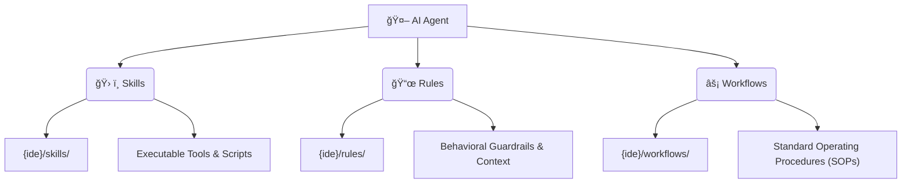

# 🧠 LMAgent: The Universal AI Agent Runtime

```text
██╗     ███╗   ███╗ █████╗  ██████╗ ███████╗███╗   ██╗████████╗
██║     ████╗ ████║██╔══██╗██╔════╝ ██╔════╝████╗  ██║╚══██╔══╝
██║     ██╔████╔██║███████║██║  ███╗█████╗  ██╔██╗ ██║   ██║   
██║     ██║╚██╔╝██║██╔══██║██║   ██║██╔══╝  ██║╚██╗██║   ██║   
███████╗██║ ╚═╝ ██║██║  ██║╚██████╔╝███████╗██║ ╚████║   ██║   
╚══════╝╚═╝     ╚═╝╚═╝  ╚═╝ ╚═════╝ ╚══════╝╚═╝  ╚═══╝   ╚═╝   
                                                  by QuBit
```

  

> **"Separate the reasoning from the execution."**  
> LMAgent is the foundational runtime that empowers your AI Agents with standardized **Skills**, **Rules**, and **Workflows** across any IDE (Cursor, Windsurf, VSCode, Zed, Qodo).

---

## 🚀 Quick Start Guide

Get your agent infrastructure up and running in less than 2 minutes.

### Option A: Direct Execution (No Install)
The fastest way to enhance your current project.

```bash
# Initialize project (copies CLAUDE.md, AGENTS.md, config, etc.)
npx lmagent init

# Install skills, rules & workflows into your IDE
npx lmagent install

# Verify everything is correctly configured
npx lmagent doctor
```

### Option B: Local Development Setup
If you want to contribute or fork the project:

1.  **Clone the Repository**
    ```bash
    git clone https://github.com/QuBit/lmagent.git
    cd lmagent
    ```

2.  **Install Dependencies**
    ```bash
    npm install
    ```

3.  **Link Globally**
    ```bash
    npm link
    lmagent install
    ```

---

## 🏛️ The 3-Pillar Architecture

LMAgent organizes AI capabilities into three distinct pillars, enforcing a clear separation of concerns.



### 1. 🛠️ Skills (Capabilities)
*Executable units that allow the Agent to interact with the world.*  
**Location:** `{ide}/skills/` or `~/.agents/skills/`

| Skill Name | Description | Tools Included |
| :--- | :--- | :--- |
| **ai-agent-engineer** | Expert in building LLM-based systems & MCP servers. | `create-agent`, `scaffold-mcp` |
| **architect** | System design, scalable patterns, cloud infrastructure. | `design-system`, `review-architecture` |
| **automation-engineer** | n8n workflows, Zapier integration, scripting. | `deploy-n8n`, `check-webhook` |
| **backend-engineer** | API design, Database schema, Authentication. | `scaffold-api`, `optimize-query` |
| **data-engineer** | ETL pipelines, SQL optimization, Data warehousing. | `analyze-schema`, `run-migration` |
| **devops-engineer** | CI/CD, Docker, Kubernetes, Terraform. | `docker-build`, `k8s-deploy` |
| **frontend-engineer** | React, Next.js, Tailwind, State Management. | `scaffold-component`, `check-accessibility` |
| **mobile-engineer** | React Native, Expo, iOS/Android build pipelines. | `build-ios`, `debug-android` |
| **orchestrator** | High-level task planning and agent coordination. | `plan-task`, `delegate-subtask` |
| **performance-engineer** | Profiling, load testing, optimization. | `run-lighthouse`, `profile-memory` |
| **product-manager** | PRD generation, user stories, roadmap planning. | `generate-user-story`, `prioritize-backlog` |
| **prompt-engineer** | Optimizing system prompts and LLM interactions. | `optimize-prompt`, `eval-prompt` |
| **qa-engineer** | E2E testing (Playwright), Unit tests, QA strategy. | `run-playwright`, `generate-test-plan` |
| **scrum-master** | Agile ceremonies, sprint planning, retrospective. | `start-sprint`, `generate-retro` |
| **security-analyst** | Vulnerability scanning, code auditing, OWASP. | `scan-vulnerabilities`, `audit-code` |
| **tech-lead** | Code review, technical decision making, mentoring. | `review-pr`, `enforce-standards` |
| **technical-writer** | Documentation, API refs, user guides. | `generate-docs`, `update-readme` |
| **ux-ui-designer** | Design systems, user flow, prototyping. | `analyze-ux`, `generate-palette` |
| **bmad-methodology** | Scale-Adaptive Intelligence, project kickoff, complexity classification. | `classify-level`, `kickoff-project` |
| **swe-agent** | Autonomous issue resolution, trajectory logging, Edit-Lint-Test loops. | `resolve-issue`, `trajectory-log` |
| **spec-driven-dev** | Spec-first development pipeline: SPECIFY → PLAN → TASKS → IMPLEMENT → VERIFY. | `create-spec`, `validate-spec` |


### 2. 📜 Rules (Context & Guardrails)
*Constraints and guidelines that shape Agent behavior.*  
**Location:** `{ide}/rules/` or `~/.agents/rules/`

| Rule File | Description |
| :--- | :--- |
| **_bootstrap.md** | ⭐ **Entry point**: Startup check, skill activation, critical rules for ALL IDEs. |
| **agents-ia.md** | Core guidelines for building AI Agents (Tool-first, Stateless, Observable). |
| **api-design.md** | REST/GraphQL standards, error handling, versioning best practices. |
| **automations-n8n.md** | Best practices for building robust n8n workflows. |
| **code-style.md** | Linter configuration, naming conventions, project structure. |
| **documentation.md** | Standards for code comments, READMEs, and architectural decision records (ADRs). |
| **security.md** | **Critical**: Input validation, secret management, OWASP Top 10 prevention. |
| **stack.md** | Approved technology stack and library choices for the project. |
| **testing.md** | Mandatory Test-Driven Development (TDD) workflows and coverage requirements. |
| **workflow.md** | General git flow and contribution guidelines. |


### 3. ⚡ Workflows (SOPs)
*Step-by-step guides for complex tasks.*  
**Location:** `{ide}/workflows/` or `~/.agents/workflows/`

| Workflow Name | Purpose |
| :--- | :--- |
| **bugfix-backend.md** | Protocol for diagnosing, fixing, and verifying server-side bugs. |
| **documentation.md** | Guide for updating and maintaining project documentation. |
| **generate-prd.md** | Template and instructions for creating Product Requirement Documents. |
| **ideation.md** | Brainstorming process for new features or products. |
| **new-agent-ia.md** | End-to-end guide for creating a new AI Agent from scratch. |
| **new-automation.md** | Steps to design and deploy a new automation (n8n/script). |
| **new-feature.md** | Standard flow: Ticket -> Design -> Implementation -> Test -> PR. |
| **optimize-performance.md** | Systematic approach to identifying and fixing bottlenecks. |
| **resolve-github-issue.md** | Standard flow for addressing GitHub Issues. |
| **security-review.md** | Checklist for pre-deployment security audits. |
| **spec-driven.md** | Development methodology based on detailed specifications (Spec-First). |
| **testing-strategy.md** | Defining the testing pyramid and strategy for a feature. |
| **third-party-integration.md** | Guide for securely integrating external APIs and SDKs. |

---

## 💎 Features & IDE Support

### 🌍 Centralized "Brain" (`~/.agents`)
LMAgent creates a **Single Source of Truth** in your home directory.
*   **Update Once, Reflect Everywhere**: Modify a rule in `~/.agents/rules/code-style.md`, and *every project* using Symlinks updates instantly.
*   **Zero-Copy Efficiency**: No more valid/duplicate `.md` files cluttering every repo.

### 🧩 Multi-IDE Support

| IDE / Agent | Support Level | Config Path |
| :--- | :--- | :--- |
| **Cursor** | ✅ Full | `.cursor/` |
| **Windsurf** | ✅ Full | `.windsurf/` |
| **VSCode / Copilot** | ✅ Full | `.github/` |
| **Zed** | ✅ Full | `.rules/` |
| **Continue** | ✅ Full | `.continue/` |
| **Trae** | ✅ Full | `.trae/` |
| **Antigravity** | ✅ Full | `.antigravity/` |
| **Cline / Roo Code** | ✅ Full | `.clinerules/` |
| **Claude Code** | ✅ Full | `.claude/` |
| **Qodo** | ✅ Full | `agents/` |

---

## 🤝 Contributing

We welcome contributions to expand the **Universal Agent Brain**.
Check out `CONTRIBUTING.md` to add new Skills, Rules, or IDE support.

### 🛠️ Creating New Skills
Need a custom agent? Use the interactive generator:

```bash
# Verify structure of existing skills
python validate_skills.py

# Create a new skill interactively
python create_skill.py
```
This will generate the standard directory structure and `SKILL.md` template for you.


---

<p align="center">
  Built with ❤️ by <b>QuBit</b>
</p>
