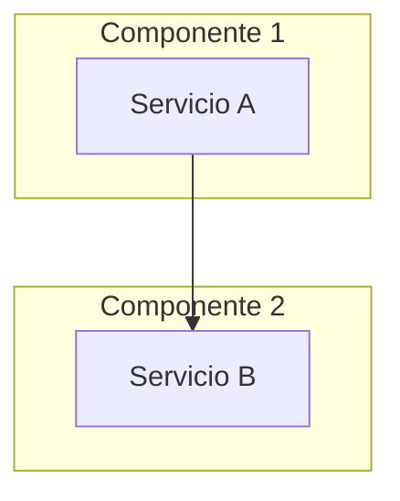

# Level 3: Complex - Checklist

## Descripción
Cambios complejos que requieren planificación extensiva.

**Tiempo estimado**: 2-8 horas
**Confirmación requerida**: Sí (obligatoria)
**Artefactos**: implementation_plan.md, architecture.md, test_plan.md

## Ejemplos
- Nuevo microservicio
- Rediseño de base de datos
- Sistema de agentes IA completo
- Pipeline de datos end-to-end
- Integración compleja con múltiples sistemas
- Refactor mayor de arquitectura

---

## Checklist

### 📋 Fase 1: Análisis Profundo

#### Entender Contexto Completo
- [ ] Leer AGENTS.md y todas las reglas aplicables
- [ ] Revisar arquitectura existente (`docs/architecture.md`)
- [ ] Identificar todos los sistemas afectados
- [ ] Mapear dependencias y flujos de datos
- [ ] Consultar con stakeholders si es necesario

#### Activar Persona: Architect
- [ ] Leer `personas/architect.md`
- [ ] Pensar en términos de arquitectura, no solo código

#### Análisis de Riesgos
```markdown
## Análisis de Riesgos

| Riesgo | Probabilidad | Impacto | Mitigación |
|--------|--------------|---------|------------|
| [Riesgo 1] | Alta/Media/Baja | Alto/Medio/Bajo | [Acción] |
| [Riesgo 2] | ... | ... | ... |
```

### 📐 Fase 2: Diseño de Arquitectura

#### Crear Documento de Arquitectura
```markdown
# Architecture: [Nombre del Sistema]

## Visión General
[Descripción de alto nivel]

## Diagrama de Arquitectura


## Componentes

### [Componente 1]
- **Responsabilidad**: [...]
- **Tecnología**: [...]
- **Interfaz**: [API, eventos, etc.]

### [Componente 2]
- ...

## Flujo de Datos
[Describir cómo fluyen los datos]

## Decisiones de Diseño (ADRs)
1. [ADR-001: Decisión 1]
2. [ADR-002: Decisión 2]

## Consideraciones de Seguridad
- [Consideración 1]
- [Consideración 2]

## Escalabilidad
[Cómo escala el sistema]
```

#### Crear ADRs (Architecture Decision Records)
```markdown
# ADR-001: [Título de la Decisión]

## Estado
Propuesto / Aceptado / Deprecado

## Contexto
[Por qué se necesita esta decisión]

## Decisión
[La decisión tomada]

## Consecuencias

### Positivas
- [Beneficio 1]

### Negativas
- [Trade-off 1]

## Alternativas Consideradas
1. [Alternativa 1] - [Por qué no]
2. [Alternativa 2] - [Por qué no]
```

### 📝 Fase 3: Plan de Implementación Detallado

#### Crear implementation_plan.md Extensivo
- [ ] Desglose por fases
- [ ] Dependencias entre tareas
- [ ] Estimaciones por fase
- [ ] Puntos de validación intermedios
- [ ] Criterios de éxito por fase

#### Crear test_plan.md
```markdown
# Test Plan: [Nombre del Sistema]

## Estrategia de Testing

### Tests Unitarios
| Módulo | Cobertura Target | Responsable |
|--------|------------------|-------------|
| [Módulo 1] | 90% | [Nombre] |

### Tests de Integración
| Flujo | Sistemas Involucrados | Prioridad |
|-------|----------------------|-----------|
| [Flujo 1] | [Sistema A, B] | Alta |

### Tests E2E
| Escenario | Steps | Expected Result |
|-----------|-------|-----------------|
| [Escenario 1] | 1. ... 2. ... | [Resultado] |

### Tests de Performance
| Endpoint | Load | Target Response Time |
|----------|------|---------------------|
| [/endpoint] | 100 req/s | < 200ms |

## Ambientes de Test
- [ ] Local
- [ ] Staging
- [ ] Pre-production
```

### ✋ Checkpoint: Obtener Aprobación

**OBLIGATORIO**: Antes de implementar, obtener aprobación de:
- [ ] Plan de implementación
- [ ] Arquitectura propuesta
- [ ] Plan de testing
- [ ] Estimaciones de tiempo

---

### 🛠️ Fase 4: Implementación por Fases

#### Fase 4.1: Infraestructura/Base
- [ ] Crear estructuras de datos
- [ ] Configurar base de datos/migraciones
- [ ] Configurar servicios base
- [ ] Verificar que todo compila/ejecuta

**Checkpoint**: Validar infraestructura antes de continuar

#### Fase 4.2: Core Logic
- [ ] Implementar servicios principales
- [ ] Implementar repositories
- [ ] Agregar tests unitarios
- [ ] Verificar cobertura

**Checkpoint**: Validar lógica core

#### Fase 4.3: APIs/Interfaces
- [ ] Implementar endpoints
- [ ] Documentar APIs
- [ ] Agregar tests de integración
- [ ] Verificar contratos

**Checkpoint**: Validar APIs

#### Fase 4.4: Integraciones
- [ ] Conectar con sistemas externos
- [ ] Implementar manejo de errores
- [ ] Agregar retries y fallbacks
- [ ] Tests E2E

**Checkpoint**: Validar integraciones

### ✅ Fase 5: Validación Extensiva

#### Tests Completos
- [ ] Tests unitarios (>= 80% coverage)
- [ ] Tests de integración
- [ ] Tests E2E
- [ ] Tests de performance (si aplica)

#### Code Quality
- [ ] Linting pasa
- [ ] Type checking pasa
- [ ] Security scan pasa
- [ ] Dependency audit pasa

#### Revisión de Arquitectura
- [ ] Implementación sigue diseño
- [ ] ADRs actualizados
- [ ] Documentación completa

### 🔄 Fase 6: Rollback Plan

#### Definir Estrategia de Rollback
```markdown
## Rollback Plan

### Trigger para Rollback
- [Condición 1]
- [Condición 2]

### Pasos de Rollback
1. [Paso 1]
2. [Paso 2]
3. [Paso 3]

### Verificación Post-Rollback
- [ ] [Check 1]
- [ ] [Check 2]

### Comunicación
- Notificar a: [personas/canales]
- Template: [mensaje de comunicación]
```

### 📝 Fase 7: Documentar y Finalizar

#### Documentación Final
- [ ] README del módulo/servicio
- [ ] API documentation
- [ ] Runbook para operaciones
- [ ] Arquitectura actualizada
- [ ] ADRs finalizados

#### PR/Merge Strategy
- [ ] Feature branch creada
- [ ] PRs incrementales si es posible
- [ ] Code review por senior/architect
- [ ] Merge strategy definida (squash, merge, rebase)

---

## Señales de que es Level 4

Escalar a Enterprise si:
- ⚠️ Afecta sistemas de producción críticos
- ⚠️ Involucra datos sensibles/PII
- ⚠️ Requiere compliance (GDPR, SOC2, etc.)
- ⚠️ Es migración de sistema legacy
- ⚠️ Requiere aprobación de múltiples stakeholders
- ⚠️ Tiempo estimado > 8 horas o múltiples días
