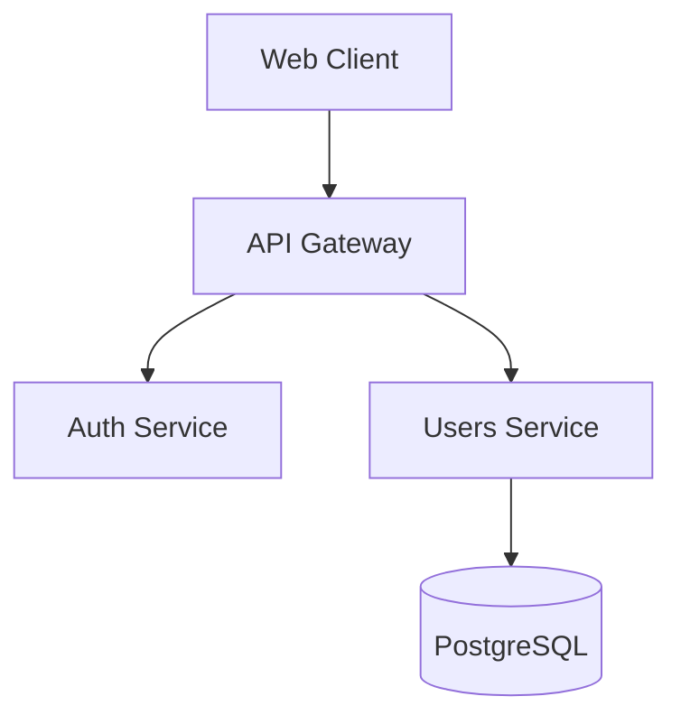

# Documentation Workflow

Este workflow guía la creación y mantenimiento de documentación.

## Tipos de Documentación

| Tipo | Audiencia | Ubicación |
|------|-----------|-----------|
| README | Nuevos contribuidores | Raíz del proyecto |
| API Docs | Desarrolladores consumidores | `/docs/api/` |
| Architecture | Equipo técnico | `/docs/architecture/` |
| User Guide | Usuarios finales | Wiki / Docs site |
| Inline Docs | Desarrolladores | En el código |

---

## README Template

```markdown
# {Nombre del Proyecto}

{Badges}

{Una línea describiendo qué hace}

## Features
- Feature 1
- Feature 2

## Quick Start
{Comandos para empezar}

## Installation
{Instrucciones detalladas}

## Usage
{Ejemplos básicos}

## Documentation
{Links a docs más detalladas}

## Contributing
{Cómo contribuir}

## License
{Licencia}
```

---

## API Documentation

### Usar OpenAPI/Swagger

```python
# FastAPI genera automáticamente
@app.get("/docs")  # Swagger UI
@app.get("/redoc") # ReDoc
```

### Documentar Endpoints

```python
@router.post(
    "/users",
    response_model=UserResponse,
    status_code=201,
    summary="Create a new user",
    description="Creates a new user with the provided data. Requires authentication.",
    responses={
        201: {"description": "User created successfully"},
        400: {"description": "Invalid request data"},
        409: {"description": "Email already exists"},
    }
)
async def create_user(data: UserCreate):
    """
    Create a new user.
    
    - **email**: Valid email address (required)
    - **name**: User's display name (required)
    - **role**: User role, defaults to 'user'
    """
    ...
```

---

## Inline Documentation

### Python Docstrings

```python
def calculate_tax(amount: Decimal, rate: Decimal) -> Decimal:
    """
    Calculate tax for a given amount.
    
    Args:
        amount: The base amount before tax
        rate: Tax rate as a decimal (e.g., 0.21 for 21%)
        
    Returns:
        The calculated tax amount
        
    Raises:
        ValueError: If amount or rate is negative
        
    Example:
        >>> calculate_tax(Decimal("100"), Decimal("0.21"))
        Decimal("21.00")
    """
```

### TypeScript JSDoc

```typescript
/**
 * Formats a date for display.
 * 
 * @param date - The date to format
 * @param locale - Optional locale, defaults to 'es-AR'
 * @returns Formatted date string
 * 
 * @example
 * formatDate(new Date()) // "21 de enero de 2024"
 */
export function formatDate(date: Date, locale = 'es-AR'): string {
  ...
}
```

---

## Architecture Documentation

### ADR Template

```markdown
# ADR-{N}: {Título}

## Status
Proposed | Accepted | Deprecated

## Context
{Qué problema estamos resolviendo}

## Decision
{Qué decidimos hacer}

## Consequences
{Qué implica esta decisión}
```

### System Diagram

```markdown
## System Architecture


```

---

## Changelog

### Keep a Changelog Format

```markdown
# Changelog

## [Unreleased]

### Added
- New feature X

### Changed
- Updated dependency Y

### Fixed
- Bug in Z

## [1.0.0] - 2024-01-21

### Added
- Initial release
```

---

## Documentation Checklist

```markdown
## Para cada release
- [ ] README actualizado
- [ ] CHANGELOG actualizado
- [ ] API docs generados
- [ ] Migration guide (si breaking changes)

## Para código nuevo
- [ ] Docstrings en funciones públicas
- [ ] Tipos bien documentados
- [ ] Ejemplos de uso

## Para features grandes
- [ ] ADR si hay decisiones arquitectónicas
- [ ] Diagrama de flujo
- [ ] User guide
```

---

## Tools

| Tool | Uso |
|------|-----|
| Swagger/OpenAPI | API REST |
| MkDocs | Documentation sites |
| Mermaid | Diagramas |
| Docusaurus | Docs con React |
| Storybook | Component docs |
