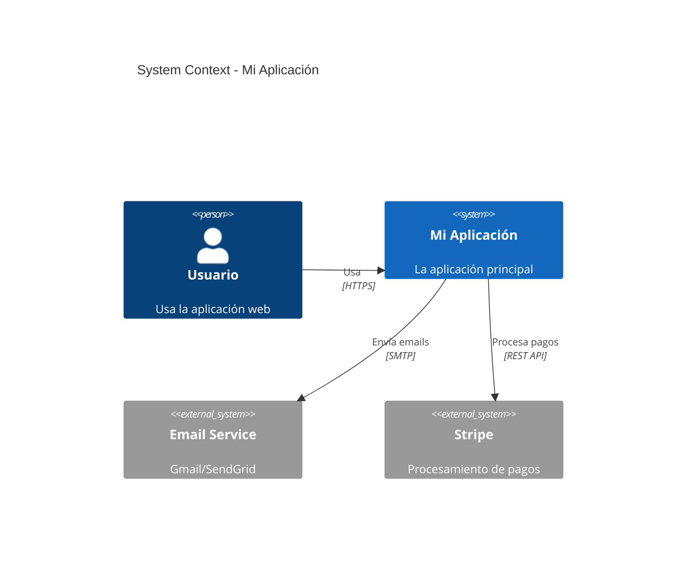

# C4 Model Reference — Architect

> Guía rápida del modelo C4 de Simon Brown para documentar arquitectura de software.

## Los 4 Niveles

```
Level 1: System Context
    → Quién usa tu sistema y con qué interactúa

Level 2: Container
    → Las piezas de alto nivel (apps, DBs, caches, queues)

Level 3: Component
    → Las piezas internas de un container (services, repos, controllers)

Level 4: Code
    → Clases y funciones (solo para código crítico)
```

## Level 1: System Context

Muestra tu sistema como una caja negra y sus relaciones externas.



**Audiencia:** Todos (PM, devs, stakeholders, management)

## Level 2: Container Diagram

Muestra los bloques de alto nivel dentro de tu sistema.

```
┌──────────────────────────────────────────────────────┐
│                    Mi Aplicación                      │
│                                                       │
│  ┌─────────┐  ┌──────────┐  ┌────────────┐          │
│  │ Frontend │  │  Backend  │  │   Worker    │         │
│  │ (React)  │──│ (FastAPI) │──│  (Celery)   │        │
│  └─────────┘  └────┬─────┘  └──────┬─────┘         │
│                     │               │                 │
│              ┌──────┴──────┐  ┌─────┴─────┐         │
│              │  PostgreSQL  │  │   Redis    │         │
│              └─────────────┘  └───────────┘         │
└──────────────────────────────────────────────────────┘
```

**Audiencia:** Equipo técnico

## Level 3: Component Diagram

Muestra las piezas internas de un container específico.

```
Backend (FastAPI)
├── API Layer
│   ├── AuthController (/api/v1/auth)
│   ├── UserController (/api/v1/users)
│   └── OrderController (/api/v1/orders)
├── Service Layer
│   ├── AuthService
│   ├── UserService
│   └── OrderService
├── Repository Layer
│   ├── UserRepository
│   └── OrderRepository
└── Infrastructure
    ├── Database (SQLModel)
    ├── Cache (Redis)
    └── Queue (Celery)
```

**Audiencia:** Desarrolladores del equipo

## ADR Template (Architecture Decision Record)

```markdown
# ADR-001: Usar PostgreSQL como base de datos principal

**Estado:** Aceptado
**Fecha:** 2024-01-21

## Contexto
Necesitamos una base de datos relacional para el MVP.

## Decisión
Usamos PostgreSQL 16.

## Alternativas
- MySQL: menos features (no JSONB, peor full-text search)
- MongoDB: no necesitamos schema-less
- SQLite: no escala para producción multi-user

## Consecuencias
- ✅ JSONB para datos semi-estructurados
- ✅ Full-text search nativo
- ✅ Excelente soporte de tooling
- ⚠️ Requiere administración (backup, vacuum)
```

## Principios de Arquitectura

| Principio | Descripción |
|-----------|------------|
| **KISS** | Keep It Simple, Stupid |
| **YAGNI** | You Ain't Gonna Need It |
| **DRY** | Don't Repeat Yourself |
| **SoC** | Separation of Concerns |
| **IoC** | Inversion of Control |
| **PoLA** | Principle of Least Astonishment |

## Quality Attributes (NFRs)

| Atributo | Métrica | Target |
|----------|---------|--------|
| **Performance** | Response time P95 | < 500ms |
| **Availability** | Uptime | 99.9% |
| **Scalability** | Concurrent users | 1000+ |
| **Security** | OWASP compliance | Top 10 addressed |
| **Maintainability** | Onboarding time | < 1 week |
| **Testability** | Code coverage | > 80% |
