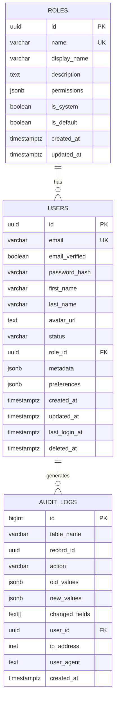

# LMAgent Database Template

Template para diseño e implementación de bases de datos PostgreSQL con migraciones.

## Estructura del Proyecto

```
database/
├── migrations/                 # Migraciones versionadas
│   ├── 001_initial_schema.sql
│   ├── 002_add_users.sql
│   └── 003_add_indexes.sql
│
├── schemas/                    # Definiciones de schema
│   ├── tables/                 # Definiciones de tablas
│   │   ├── users.sql
│   │   ├── roles.sql
│   │   └── audit_logs.sql
│   ├── views/                  # Views
│   │   └── active_users_v.sql
│   ├── functions/              # Stored functions
│   │   └── update_timestamp.sql
│   └── triggers/               # Triggers
│       └── audit_trigger.sql
│
├── seeds/                      # Datos iniciales
│   ├── 01_roles.sql
│   └── 02_admin_user.sql
│
├── queries/                    # Queries comunes documentadas
│   ├── reports/
│   │   └── user_activity.sql
│   └── maintenance/
│       └── vacuum_analyze.sql
│
├── diagrams/                   # Diagramas ERD
│   └── erd.mmd                 # Mermaid diagram
│
├── scripts/                    # Scripts de utilidad
│   ├── backup.sh
│   ├── restore.sh
│   └── migrate.py
│
└── README.md
```

## Schema Base

### Tabla de Usuarios

```sql
-- schemas/tables/users.sql

CREATE TABLE IF NOT EXISTS users (
    id UUID PRIMARY KEY DEFAULT gen_random_uuid(),
    email VARCHAR(255) NOT NULL UNIQUE,
    email_verified BOOLEAN DEFAULT FALSE,
    password_hash VARCHAR(255),
    
    -- Profile
    first_name VARCHAR(100),
    last_name VARCHAR(100),
    avatar_url TEXT,
    
    -- Status
    status VARCHAR(20) DEFAULT 'active' CHECK (status IN ('active', 'inactive', 'suspended', 'deleted')),
    role_id UUID REFERENCES roles(id),
    
    -- Metadata
    metadata JSONB DEFAULT '{}',
    preferences JSONB DEFAULT '{}',
    
    -- Timestamps
    created_at TIMESTAMPTZ DEFAULT NOW(),
    updated_at TIMESTAMPTZ DEFAULT NOW(),
    last_login_at TIMESTAMPTZ,
    deleted_at TIMESTAMPTZ,
    
    -- Constraints
    CONSTRAINT email_format CHECK (email ~* '^[A-Za-z0-9._%+-]+@[A-Za-z0-9.-]+\.[A-Za-z]{2,}$')
);

-- Índices
CREATE INDEX idx_users_email ON users(email);
CREATE INDEX idx_users_status ON users(status) WHERE status != 'deleted';
CREATE INDEX idx_users_role ON users(role_id);
CREATE INDEX idx_users_created ON users(created_at DESC);

-- Índice para búsqueda full-text
CREATE INDEX idx_users_fulltext ON users USING GIN (
    to_tsvector('spanish', coalesce(first_name, '') || ' ' || coalesce(last_name, '') || ' ' || email)
);

COMMENT ON TABLE users IS 'Tabla principal de usuarios del sistema';
COMMENT ON COLUMN users.metadata IS 'Datos adicionales flexibles en formato JSON';
```

### Tabla de Roles

```sql
-- schemas/tables/roles.sql

CREATE TABLE IF NOT EXISTS roles (
    id UUID PRIMARY KEY DEFAULT gen_random_uuid(),
    name VARCHAR(50) NOT NULL UNIQUE,
    display_name VARCHAR(100) NOT NULL,
    description TEXT,
    
    -- Permisos como JSONB
    permissions JSONB NOT NULL DEFAULT '[]',
    
    -- Flags
    is_system BOOLEAN DEFAULT FALSE,  -- No editable por usuarios
    is_default BOOLEAN DEFAULT FALSE, -- Rol por defecto para nuevos usuarios
    
    -- Timestamps
    created_at TIMESTAMPTZ DEFAULT NOW(),
    updated_at TIMESTAMPTZ DEFAULT NOW()
);

-- Índices
CREATE INDEX idx_roles_name ON roles(name);
CREATE INDEX idx_roles_is_default ON roles(is_default) WHERE is_default = TRUE;

-- Datos iniciales
INSERT INTO roles (name, display_name, description, permissions, is_system, is_default) VALUES
    ('admin', 'Administrador', 'Acceso completo al sistema', '["*"]', TRUE, FALSE),
    ('user', 'Usuario', 'Usuario estándar', '["read", "write"]', TRUE, TRUE),
    ('viewer', 'Visor', 'Solo lectura', '["read"]', TRUE, FALSE);
```

### Tabla de Auditoría

```sql
-- schemas/tables/audit_logs.sql

CREATE TABLE IF NOT EXISTS audit_logs (
    id BIGSERIAL PRIMARY KEY,
    
    -- Qué cambió
    table_name VARCHAR(100) NOT NULL,
    record_id UUID NOT NULL,
    action VARCHAR(10) NOT NULL CHECK (action IN ('INSERT', 'UPDATE', 'DELETE')),
    
    -- Datos del cambio
    old_values JSONB,
    new_values JSONB,
    changed_fields TEXT[],
    
    -- Quién y cuándo
    user_id UUID REFERENCES users(id),
    ip_address INET,
    user_agent TEXT,
    
    -- Timestamp
    created_at TIMESTAMPTZ DEFAULT NOW()
);

-- Particionamiento por mes para mejor performance
CREATE INDEX idx_audit_created ON audit_logs(created_at);
CREATE INDEX idx_audit_table_record ON audit_logs(table_name, record_id);
CREATE INDEX idx_audit_user ON audit_logs(user_id);

-- Partición automática (PostgreSQL 14+)
-- ALTER TABLE audit_logs PARTITION BY RANGE (created_at);
```

## Functions y Triggers

### Update Timestamp Automático

```sql
-- schemas/functions/update_timestamp.sql

CREATE OR REPLACE FUNCTION update_updated_at()
RETURNS TRIGGER AS $$
BEGIN
    NEW.updated_at = NOW();
    RETURN NEW;
END;
$$ LANGUAGE plpgsql;

-- Aplicar a todas las tablas con updated_at
CREATE TRIGGER tr_users_updated_at
    BEFORE UPDATE ON users
    FOR EACH ROW
    EXECUTE FUNCTION update_updated_at();

CREATE TRIGGER tr_roles_updated_at
    BEFORE UPDATE ON roles
    FOR EACH ROW
    EXECUTE FUNCTION update_updated_at();
```

### Trigger de Auditoría

```sql
-- schemas/triggers/audit_trigger.sql

CREATE OR REPLACE FUNCTION audit_trigger_func()
RETURNS TRIGGER AS $$
DECLARE
    old_data JSONB;
    new_data JSONB;
    changed_cols TEXT[];
BEGIN
    IF TG_OP = 'DELETE' THEN
        old_data = to_jsonb(OLD);
        
        INSERT INTO audit_logs (table_name, record_id, action, old_values, user_id)
        VALUES (TG_TABLE_NAME, OLD.id, 'DELETE', old_data, current_setting('app.current_user_id', TRUE)::UUID);
        
        RETURN OLD;
        
    ELSIF TG_OP = 'UPDATE' THEN
        old_data = to_jsonb(OLD);
        new_data = to_jsonb(NEW);
        
        -- Detectar columnas cambiadas
        SELECT array_agg(key) INTO changed_cols
        FROM jsonb_each(new_data)
        WHERE new_data -> key IS DISTINCT FROM old_data -> key;
        
        INSERT INTO audit_logs (table_name, record_id, action, old_values, new_values, changed_fields, user_id)
        VALUES (TG_TABLE_NAME, NEW.id, 'UPDATE', old_data, new_data, changed_cols, current_setting('app.current_user_id', TRUE)::UUID);
        
        RETURN NEW;
        
    ELSIF TG_OP = 'INSERT' THEN
        new_data = to_jsonb(NEW);
        
        INSERT INTO audit_logs (table_name, record_id, action, new_values, user_id)
        VALUES (TG_TABLE_NAME, NEW.id, 'INSERT', new_data, current_setting('app.current_user_id', TRUE)::UUID);
        
        RETURN NEW;
    END IF;
    
    RETURN NULL;
END;
$$ LANGUAGE plpgsql;

-- Aplicar a tablas que requieren auditoría
CREATE TRIGGER tr_users_audit
    AFTER INSERT OR UPDATE OR DELETE ON users
    FOR EACH ROW
    EXECUTE FUNCTION audit_trigger_func();
```

## Migraciones

### Ejemplo de Migración

```sql
-- migrations/001_initial_schema.sql
-- Migration: Initial Schema
-- Created: 2024-01-01
-- Author: DBA Engineer

BEGIN;

-- Verificar que no existe
DO $$
BEGIN
    IF EXISTS (SELECT 1 FROM information_schema.tables WHERE table_name = 'users') THEN
        RAISE EXCEPTION 'Migration already applied';
    END IF;
END $$;

-- Crear extensiones necesarias
CREATE EXTENSION IF NOT EXISTS "uuid-ossp";
CREATE EXTENSION IF NOT EXISTS "pgcrypto";

-- Crear tablas (ejecutar en orden de dependencias)
\i schemas/tables/roles.sql
\i schemas/tables/users.sql
\i schemas/tables/audit_logs.sql

-- Crear functions y triggers
\i schemas/functions/update_timestamp.sql
\i schemas/triggers/audit_trigger.sql

-- Registrar migración
CREATE TABLE IF NOT EXISTS _migrations (
    id SERIAL PRIMARY KEY,
    name VARCHAR(255) NOT NULL UNIQUE,
    applied_at TIMESTAMPTZ DEFAULT NOW()
);

INSERT INTO _migrations (name) VALUES ('001_initial_schema');

COMMIT;
```

## Script de Migración (Python)

```python
#!/usr/bin/env python3
# scripts/migrate.py

"""
Database migration script for LMAgent.

Usage:
    python migrate.py up      # Apply all pending migrations
    python migrate.py down    # Rollback last migration
    python migrate.py status  # Show migration status
"""

import os
import sys
from pathlib import Path
import psycopg2
from psycopg2.extras import RealDictCursor

DATABASE_URL = os.getenv("DATABASE_URL", "postgresql://localhost/lmagent")
MIGRATIONS_DIR = Path(__file__).parent.parent / "migrations"


def get_connection():
    return psycopg2.connect(DATABASE_URL, cursor_factory=RealDictCursor)


def get_applied_migrations(conn):
    with conn.cursor() as cur:
        cur.execute("""
            CREATE TABLE IF NOT EXISTS _migrations (
                id SERIAL PRIMARY KEY,
                name VARCHAR(255) NOT NULL UNIQUE,
                applied_at TIMESTAMPTZ DEFAULT NOW()
            )
        """)
        cur.execute("SELECT name FROM _migrations ORDER BY id")
        return {row['name'] for row in cur.fetchall()}


def get_pending_migrations(applied):
    all_migrations = sorted(MIGRATIONS_DIR.glob("*.sql"))
    return [m for m in all_migrations if m.stem not in applied]


def apply_migration(conn, migration_file):
    print(f"Applying: {migration_file.name}")
    
    with open(migration_file) as f:
        sql = f.read()
    
    with conn.cursor() as cur:
        cur.execute(sql)
        cur.execute(
            "INSERT INTO _migrations (name) VALUES (%s)",
            (migration_file.stem,)
        )
    
    conn.commit()
    print(f"✓ Applied: {migration_file.name}")


def main():
    if len(sys.argv) < 2:
        print("Usage: migrate.py [up|down|status]")
        sys.exit(1)
    
    command = sys.argv[1]
    
    with get_connection() as conn:
        applied = get_applied_migrations(conn)
        pending = get_pending_migrations(applied)
        
        if command == "status":
            print(f"Applied: {len(applied)}")
            print(f"Pending: {len(pending)}")
            for m in pending:
                print(f"  - {m.name}")
                
        elif command == "up":
            if not pending:
                print("No pending migrations")
                return
            
            for migration in pending:
                apply_migration(conn, migration)
            
            print(f"\n✓ Applied {len(pending)} migration(s)")
            
        elif command == "down":
            print("Rollback not implemented - use manual SQL")
            
        else:
            print(f"Unknown command: {command}")
            sys.exit(1)


if __name__ == "__main__":
    main()
```

## Diagrama ERD



## Best Practices

### Naming Conventions

| Tipo | Convención | Ejemplo |
|------|------------|---------|
| Tablas | snake_case, plural | `users`, `audit_logs` |
| Columnas | snake_case | `first_name`, `created_at` |
| Índices | `idx_{table}_{columns}` | `idx_users_email` |
| Foreign Keys | `fk_{table}_{ref_table}` | `fk_users_roles` |
| Constraints | `chk_{table}_{column}` | `chk_users_status` |
| Triggers | `tr_{table}_{action}` | `tr_users_audit` |
| Functions | verb_noun | `update_timestamp()` |

### Checklist de Diseño

- [ ] Usar UUID para PKs (mejor para distribución)
- [ ] Incluir `created_at`, `updated_at` en todas las tablas
- [ ] Soft delete con `deleted_at` en vez de DELETE físico
- [ ] Índices en FKs y columnas de búsqueda frecuente
- [ ] JSONB para datos flexibles, no para datos relacionales
- [ ] Constraints CHECK para validaciones de dominio
- [ ] Comentarios en tablas y columnas importantes
- [ ] Migraciones versionadas y atómicas
- [ ] Auditoría para datos sensibles
- [ ] Particionamiento para tablas de alto volumen
