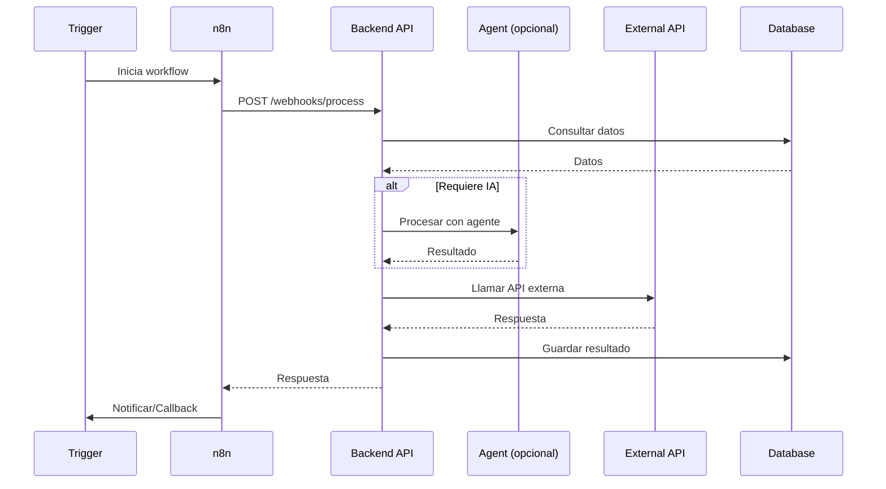

# New Automation Workflow

> **Tiempo estimado**: 2-6 horas | **Level**: 2-3

Este workflow guía la creación de una nueva automatización end-to-end.

## Pre-requisitos

1. Leer [AGENTS.md](../AGENTS.md)
2. Leer [rules/automations-n8n.md](../rules/automations-n8n.md)
3. Leer [rules/stack.md](../rules/stack.md)

## Información Requerida

Antes de comenzar, necesito entender:

1. **Descripción de negocio**: ¿Qué proceso se quiere automatizar?
2. **Trigger**: ¿Qué inicia la automatización? (webhook, schedule, evento)
3. **Sistemas involucrados**: ¿Qué APIs/servicios se conectan?
4. **Output esperado**: ¿Cuál es el resultado final?
5. **Requisitos de fiabilidad**: ¿Crítico? ¿Tolerancia a fallos?
6. **Latencia aceptable**: ¿Tiempo máximo de ejecución?
7. **¿Involucra agentes IA?**: ¿Necesita procesamiento con LLM?

---

## Paso 1: Analizar y Clasificar

### Determinar Nivel
- **Level 2**: Automatización simple (1-2 sistemas, sin IA)
- **Level 3**: Automatización compleja (3+ sistemas, con IA, crítica)

### Activar Personas
```
Automatización simple  → Automation Engineer
Con backend custom     → + Backend Engineer
Con agentes IA         → + AI Agent Engineer
```

---

## Paso 2: Diseñar Arquitectura

### 2.1 Diagrama de Flujo



### 2.2 Definir Componentes

| Componente | Tipo | Descripción |
|------------|------|-------------|
| Trigger | [Webhook/Schedule/Event] | [Descripción] |
| n8n Workflow | [Nombre] | [Pasos principales] |
| Backend Endpoint | [POST /webhooks/xxx] | [Procesamiento] |
| Agente IA | [Nombre o N/A] | [Tarea del agente] |
| Sistemas externos | [Lista] | [APIs/servicios] |
| Storage | [DB/Redis/Files] | [Qué se guarda] |

---

## Paso 3: Crear Plan de Implementación

### Archivos a Crear/Modificar

```markdown
## Backend

### Nuevos archivos
- [ ] `app/routers/webhooks/{automation_name}.py` - Endpoint del webhook
- [ ] `app/services/{automation_name}_service.py` - Lógica de negocio
- [ ] `app/schemas/{automation_name}.py` - Schemas de request/response

### Modificaciones
- [ ] `app/routers/__init__.py` - Registrar nuevo router
- [ ] `tests/test_{automation_name}.py` - Tests

## n8n

### Nuevo workflow
- [ ] `automations/n8n/workflows/{automation_name}.json` - Export del workflow

### Documentación
- [ ] `automations/docs/{automation_name}.md` - Documentación completa

## Agente (si aplica)

- [ ] `agents/config/agents.yaml` - Registrar nuevo agente
- [ ] `agents/python/prompts/{agent_name}.md` - Prompt del agente
```

### Orden de Implementación

1. **Schemas** - Definir estructuras de datos
2. **Service** - Implementar lógica de negocio
3. **Endpoint** - Crear webhook
4. **Tests** - Escribir tests
5. **n8n Workflow** - Crear flujo en n8n
6. **Documentación** - Documentar para el equipo

---

## Paso 4: Implementar

### 4.1 Crear Endpoint (FastAPI)

```python
# app/routers/webhooks/{automation_name}.py

from fastapi import APIRouter, BackgroundTasks
from pydantic import BaseModel
from datetime import datetime
from uuid import uuid4

router = APIRouter(tags=["webhooks"])

class {AutomationName}Request(BaseModel):
    """Request para {automation_name}."""
    # Definir campos según requerimientos
    pass

class {AutomationName}Response(BaseModel):
    """Response para {automation_name}."""
    success: bool
    request_id: str
    message: str
    processed_at: datetime

@router.post("/{automation-name}")
async def handle_{automation_name}(
    request: {AutomationName}Request,
    background_tasks: BackgroundTasks
) -> {AutomationName}Response:
    """
    Webhook para {descripción}.
    
    ## Uso en n8n
    [Documentar aquí cómo usar desde n8n]
    """
    request_id = str(uuid4())
    
    background_tasks.add_task(
        process_{automation_name},
        request_id=request_id,
        data=request
    )
    
    return {AutomationName}Response(
        success=True,
        request_id=request_id,
        message="Queued for processing",
        processed_at=datetime.utcnow()
    )
```

### 4.2 Crear Service

```python
# app/services/{automation_name}_service.py

from app.schemas.{automation_name} import {AutomationName}Request
import structlog

logger = structlog.get_logger()

async def process_{automation_name}(
    request_id: str,
    data: {AutomationName}Request
) -> dict:
    """
    Procesa la automatización {automation_name}.
    """
    logger.info(
        "{automation_name}_start",
        request_id=request_id
    )
    
    try:
        # 1. Validar datos
        # 2. Procesar lógica de negocio
        # 3. Llamar APIs externas si necesario
        # 4. Guardar resultados
        
        result = {}
        
        logger.info(
            "{automation_name}_complete",
            request_id=request_id
        )
        
        return result
        
    except Exception as e:
        logger.error(
            "{automation_name}_error",
            request_id=request_id,
            error=str(e)
        )
        raise
```

### 4.3 Crear Workflow n8n

1. Abrir n8n
2. Crear nuevo workflow
3. Agregar nodos según el diseño
4. Configurar credenciales
5. Probar con datos de ejemplo
6. Exportar JSON a `automations/n8n/workflows/`

---

## Paso 5: Testing

### Tests Unitarios
```python
# tests/test_{automation_name}.py

import pytest
from httpx import AsyncClient

@pytest.mark.asyncio
async def test_{automation_name}_success(client: AsyncClient):
    """Test caso exitoso."""
    response = await client.post(
        "/webhooks/{automation-name}",
        json={
            # Datos de prueba
        }
    )
    
    assert response.status_code == 200
    data = response.json()
    assert data["success"] is True
    assert "request_id" in data

@pytest.mark.asyncio
async def test_{automation_name}_invalid_payload(client: AsyncClient):
    """Test payload inválido."""
    response = await client.post(
        "/webhooks/{automation-name}",
        json={}  # Payload vacío
    )
    
    assert response.status_code == 422  # Validation error
```

### Test E2E con n8n
1. Ejecutar workflow de prueba en n8n
2. Verificar que el webhook recibe correctamente
3. Verificar procesamiento completo
4. Verificar resultado final

---

## Paso 6: Documentación

### Crear documentación en `automations/docs/{automation_name}.md`

```markdown
# {Automation Name}

## Descripción
[Qué hace esta automatización]

## Trigger
- **Tipo**: [Webhook | Schedule | Event]
- **Endpoint**: POST /webhooks/{automation-name}
- **Schedule**: [Cron expression si aplica]

## Flujo
1. [Paso 1]
2. [Paso 2]
3. [Paso 3]

## Sistemas Involucrados
- **Backend**: [Endpoint y función]
- **n8n**: [Nombre del workflow]
- **APIs externas**: [Lista]
- **Base de datos**: [Tablas afectadas]

## Request/Response

### Request
```json
{
    "field1": "value",
    "field2": 123
}
```

### Response
```json
{
    "success": true,
    "request_id": "uuid",
    "message": "processed"
}
```

## Manejo de Errores
| Error | Causa | Solución |
|-------|-------|----------|
| [Error 1] | [Causa] | [Solución] |

## Monitoreo
- **Logs**: Buscar por request_id
- **Métricas**: [Métricas a monitorear]
- **Alertas**: [Condiciones de alerta]
```

---

## Checklist Final

- [ ] Endpoint implementado y desplegado
- [ ] Service con lógica completa
- [ ] Tests unitarios pasando (>80% coverage)
- [ ] Workflow n8n creado y probado
- [ ] Documentación completa
- [ ] Credenciales configuradas
- [ ] Monitoreo/alertas configuradas
- [ ] Review de código completado

---

## 🛠️ Herramientas Sugeridas

| Fase | Herramienta |
|------|-------------|
| Diseño | `write_to_file` (schemas, docs) |
| Backend | `run_command` (pytest), `grep_search` |
| n8n | `browser_subagent` (probar workflows) |
| Validación | `run_command` (curl, pytest) |

## ⚠️ Errores Comunes

| Error | Solución |
|-------|----------|
| Webhook sin idempotencia | Diseñar para re-ejecución segura |
| Sin manejo de errores en n8n | Agregar Error Workflow o nodo IF |
| Credenciales hardcodeadas | Usar credentials store de n8n |
| Respuesta > 60s sin async | Usar background task + polling/callback |
